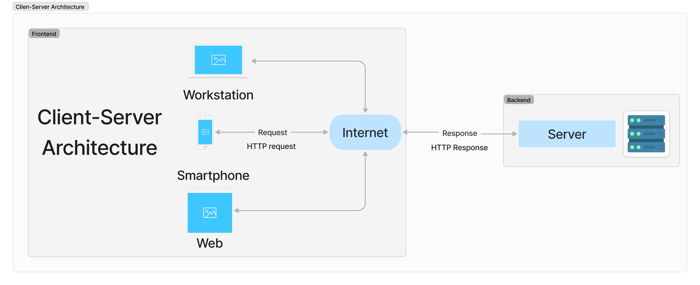
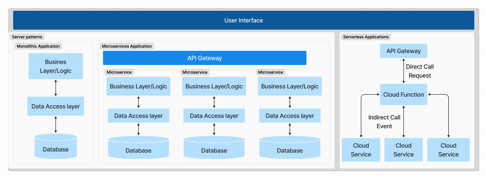
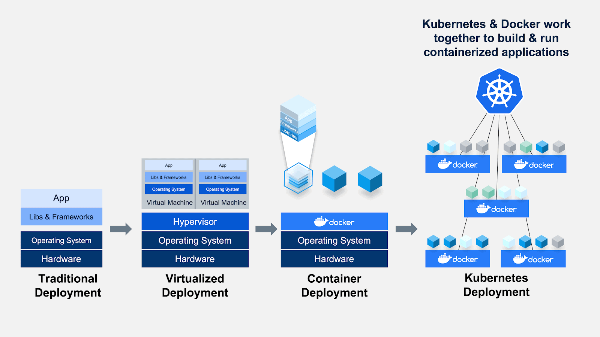
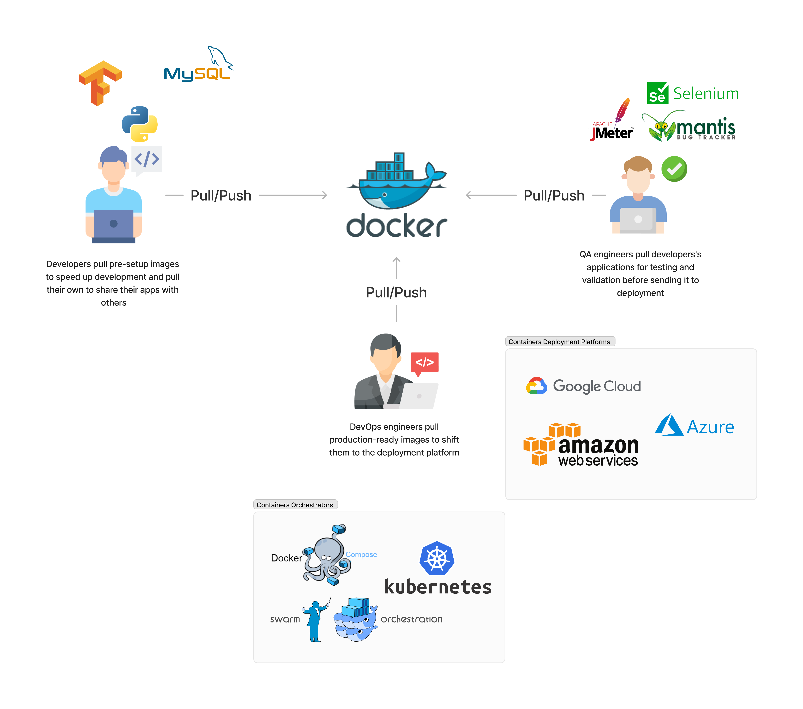
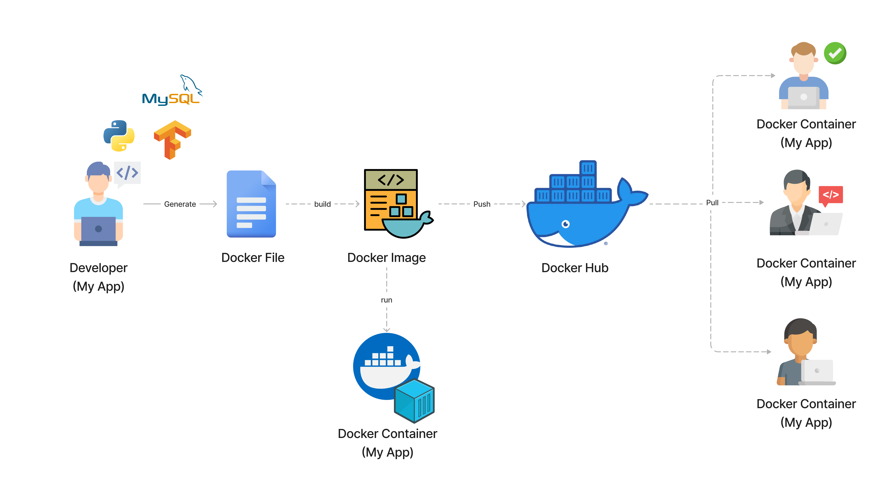
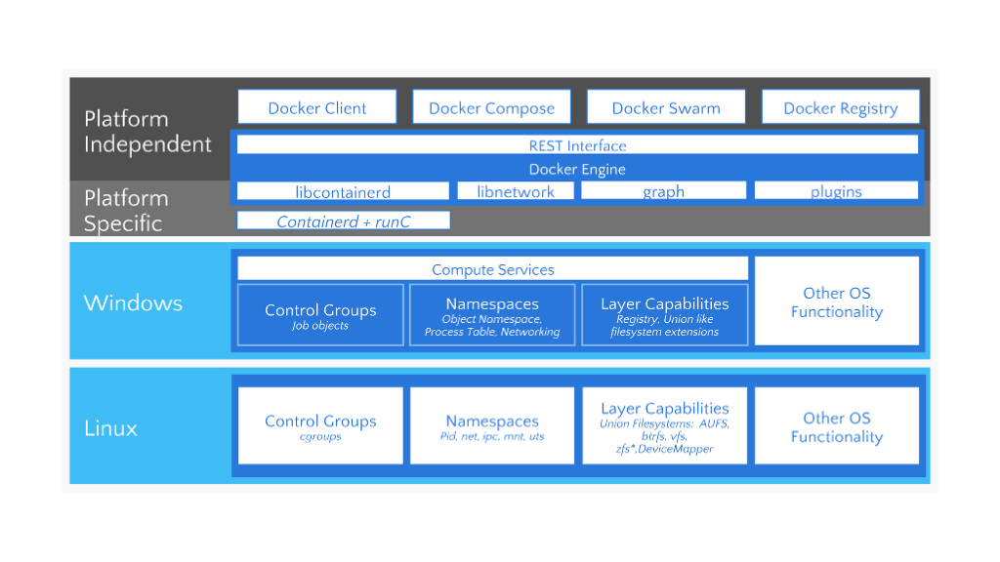

import AudioPlayer from "@site/src/components/AudioPlayer";

<AudioPlayer audioSrc={require("./audio.wav").default} />

<!--truncate-->


## Introduction

System design is the process of laying out a system's structure, components, modules, interfaces, and data to meet specified requirements. It is a multidisciplinary field that requires a wide range of skills and knowledge, including software engineering, computer science, network engineering, and project management. For machine learning engineers and data scientists, comprehending a system's life cycle provides a blueprint for building, deploying, and maintaining ML/AI solutions in production. This post will introduce and discuss some of the more critical stages of the system design process (including requirements analysis, architecture, development, deployment, and scaling). It will also introduce some technologies and tools that can be used to design, develop, and deploy systems, such as Docker, Docker Compose, Docker Swarm, and Kubernetes.


## System design process overview

### 1. Defining the requirements of the system

Defining the requirements of the system is the first step in the system design process, and it involves gathering, analyzing, and documenting the requirements for the system. The requirements analysis phase is crucial, as it provides the foundation for the rest of the system design process. It helps to ensure that the system will meet the needs of its users and stakeholders and that it will be developed within the constraints of time, budget, and resources. The requirements analysis phase typically involves the following activities:

1. **Gathering Requirements**: This involves collecting information about the needs, goals, and constraints of the system from its users and stakeholders. This information can be gathered through interviews, surveys, questionnaires, and workshops.

2. **Analyzing Requirements**: This involves analyzing the gathered information to identify the key features, functions, and constraints of the system. It also involves identifying any conflicts or inconsistencies in the requirements.

3. **Documenting Requirements**: This involves documenting the requirements in a clear, concise, and unambiguous manner. The requirements should be documented in a way that is understandable to all stakeholders, including developers, testers, and project managers.

4. **Validating Requirements**: This involves validating the requirements with the users and stakeholders to ensure that they accurately reflect their needs and goals. It also involves ensuring that the requirements are complete, consistent, and feasible.

5. **Managing Requirements**: This involves managing changes to the requirements throughout the system design process. It involves tracking changes, resolving conflicts, and ensuring that the requirements are kept up-to-date.

#### Types of Requirements

There are several types of requirements that need to be considered when designing a system. These include:

1. **Functional Requirements**: These are the requirements that describe the functions, features, and capabilities of the system. They specify what the system should do, and they are typically expressed as use cases, user stories, or functional specifications.

2. **Non-Functional Requirements**: These are the requirements that describe the quality attributes of the system, such as performance, reliability, availability, security, and usability. They specify how well the system should perform, and they are typically expressed as performance requirements, security requirements, and usability requirements.

3. **Business Requirements**: These are the requirements that describe the business goals, objectives, and constraints of the system. They specify why the system is being developed, and they are typically expressed as business cases, business rules, and business process models.

4. **User Requirements**: These are the requirements that describe the needs, goals, and constraints of the users of the system. They specify who will use the system, and they are typically expressed as user profiles, user scenarios, and user interface designs.

5. **System Requirements**: These are the requirements that describe the technical constraints and dependencies of the system. They specify how the system will be developed, deployed, and maintained, and they are typically expressed as system architecture, system interfaces, and system dependencies.

6. **Regulatory Requirements**: These are the requirements that describe the legal, ethical, and regulatory constraints of the system. They specify how the system should comply with laws, regulations, and standards, and they are typically expressed as compliance requirements, privacy requirements, and security requirements.

7. **Data Requirements**: These are the requirements that describe the data needs, constraints, and dependencies of the system. They specify what data the system will use, store, and process, and they are typically expressed as data models, data flows, and data storage.

### 2. Selecting the appropriate methodology

Like any other software solution, ML systems require a well-structured methodology to maximize the success rate of the implementation. ML algorithms are the less challenging part. The hard part is making algorithms work with other software components to solve real-world problems.

There are several **software development methodologies** that can be used to develop a ML system, such as the waterfall model, the agile model, and the iterative model. Each of these methodologies has its own strengths and weaknesses, and they are suitable for different types of projects and teams. These methodologies also provided a framework for gathering, analyzing, and documenting the requirements the system.

1. **Waterfall Model**: The waterfall model is a linear and sequential software development methodology that divides the development process into distinct phases, such as requirements analysis, design, implementation, testing, and maintenance. Each phase must be completed before the next phase can begin, and the process is difficult to change once it has started. The waterfall model is suitable for projects with well-defined requirements and stable technologies, but it is not suitable for projects with changing requirements and emerging technologies.

2. **Agile Model**: The agile model is an iterative and incremental software development methodology that focuses on delivering working software in short iterations, typically two to four weeks. It emphasizes collaboration, flexibility, and customer feedback, and it is suitable for projects with changing requirements and emerging technologies. The agile model is based on the principles of the Agile Manifesto, which emphasizes individuals and interactions, working software, customer collaboration, and responding to change.

3. **Iterative Model**: The iterative model is a software development methodology that divides the development process into small, incremental, and iterative cycles, each of which produces a working prototype of the system. The iterative model is suitable for projects with evolving requirements and complex technologies, and it is based on the principles of the spiral model, which emphasizes risk management, prototyping, and incremental development.

#### Adaptations for ML and Data Science Projects

**Considerations**

While these methodologies offer frameworks for managing work, ML projects may require specific adaptations:

1. **Iterative Experimentation:** Embrace the iterative nature of ML, where initial models often serve as baselines for further experimentation and refinement.

2. **Flexible Planning:** Allow for adjustments in project scope and direction based on intermediate results and discoveries.

3. **Model Versioning and Experiment Tracking:** Implement tools and practices for tracking different model versions, experiment parameters, and results to ensure reproducibility and facilitate decision-making.

4. **Collaboration between Data Scientists and Domain Experts:** Foster close collaboration to ensure that models are developed with a deep understanding of the domain and are aligned with business needs.

**Adaptations**

1. **Scrum:** Scrum is a popular Agile framework that organizes work into small, manageable pieces delivered in short cycles called sprints, typically lasting 2-4 weeks. For ML projects, Scrum can facilitate rapid experimentation and iteration. Teams can define sprints for different phases of ML development, such as data preparation, model training, evaluation, and deployment. Daily stand-ups can help track progress and address blockers quickly.

2. **Kanban:** Kanban emphasizes continuous delivery without overburdening the team, using a visual board to track work items through various stages of completion. In ML projects, Kanban can be used to manage the flow of tasks like data annotation, feature engineering, model experimentation, and performance tuning. Its flexibility is particularly useful for projects where priorities shift frequently based on experimental results or business needs.

3. **Extreme Programming (XP):** XP focuses on technical excellence and high customer involvement, with practices like pair programming, test-driven development (TDD), and frequent releases. While some XP practices may not directly translate to ML projects (e.g., TDD is challenging due to the probabilistic nature of ML outcomes), the emphasis on quality and collaboration can be beneficial. For instance, pair programming can be adapted for collaborative model development and code reviews, ensuring high-quality code and model architecture.

4. **Lean Development:** Lean development aims to reduce waste and focus on delivering value. For ML projects, this can mean focusing on high-value tasks, such as feature engineering, model experimentation, and deployment, while minimizing time spent on less critical activities. Techniques like value stream mapping can help identify bottlenecks and streamline the ML workflow.

5. **Feature-Driven Development (FDD):** FDD is an iterative and incremental approach that focuses on building features in short iterations. For ML projects, this can translate to developing specific features or components of the ML pipeline in short cycles, ensuring that each iteration delivers tangible value.

Once we have gathered, analyzed, and documented the requirements for the system, we can move on to the next phase of the system design process, which is architecturing the system.

### 3. Architecturing your solution

Architecturing a system is the act of decomposing a system into multiple building blocks so that we can identify how each building block can be developed, deployed, and maintained to achieve a high level of modularity, flexibility, and scalability. The architecture of a system provides a high-level view of how these components are arranged and interact with each other to achieve the desired functionality and performance. Several architectural styles and patterns can be used to design a system, including the client-server architecture, the microservices architecture, and the event-driven architecture. However, selecting the appropriate architectural style depends on the type of application to be developed and the system's requirements.

Classifying applications involves categorizing them based on criteria such as functionality, deployment methods, technology used, target user base, and platform. Here, we are providing a classification based on the deployment model.

- **Web Applications:** Accessed via web browsers, e.g., Google Docs, Salesforce.
- **Desktop Applications:** Installed on a personal computer or laptop, e.g., Microsoft Word, Adobe Photoshop.
- **Mobile Applications:** Designed for smartphones and tablets, e.g., Instagram, Uber.
- **Cloud Applications:** Hosted on cloud services and accessible over the Internet, e.g., Dropbox, Slack.

An ML model can be deployed in any of these application types. For example, a web application can use machine learning to provide personalized recommendations to users; a desktop application can use a machine learning model to automate repetitive tasks; and a mobile application can use a machine learning model to recognize speech or images, etc.

#### Client-"Server" Architecture

For web applications, cloud applications, and sometimes mobile applications, the **client-server architecture** is a common choice for the system architecture. The client-server architecture is a distributed computing architecture that divides the system into two major components: the client and the server. The client is the end-user device or application that requests and consumes the services provided by the server. The server is the remote computer or service that provides the resources, services, or data to the client. The client-server architecture provides a scalable, flexible, and reliable way to distribute and manage resources and services across a network. This architecture consists of the following components:

1. **Client**: The client is a device or a program that requests resources and services from the server. The client can be a web browser, a mobile app, or a desktop application.

2. **Server**: The server is a device or a program that provides resources and services to the client. The server can be a web server, an application server, or a database server.

3. **Network**: The network is the medium through which the client and server communicate with each other. The network can be a local area network (LAN), a wide area network (WAN), or the internet.

4. **Protocol**: The protocol is a set of rules and conventions that govern the communication between the client and server. The protocol can be HTTP, HTTPS, TCP, or UDP.

In software development, the component of your app running in the client side is called the **frontend** and the component running in the server side is called the **backend**. The frontend is responsible for the user interface and user experience, while the backend is responsible for the business logic, data storage, and integration with external systems. The frontend and backend communicate with each other using APIs, such as RESTful APIs, GraphQL APIs, or WebSocket APIs. I will discuss more about APIs and Webservices in a future post.



Client-Server-based applications can be deployed in different ways, following different architectural patterns. The most common ones are:

#### Server-Based architecture patterns

#### Monolithic Architecture

The monolithic architecture is a traditional software architecture pattern that consists of a single, self-contained application that contains all the components, modules, and services of the system. The monolithic architecture is based on the principles of tight coupling, where the components of the system are tightly integrated and dependent on each other. The monolithic architecture is suitable for small to medium-sized applications with simple requirements and low complexity. It is also suitable for applications with stable technologies and well-defined requirements. The monolithic architecture consists of the following components:

1. **User Interface**: The user interface is the front-end component of the system that interacts with the user. It can be a web interface, a mobile interface, or a desktop interface.
2. **Business Logic**: The business logic is the core component of the system that implements the business rules, processes, and workflows. It can be implemented as a set of classes, functions, or procedures.
3. **Data Storage**: The data storage is the back-end component of the system that stores and manages the data. It can be a relational database, a NoSQL database, or a file system.
4. **Integration**: The integration is the component of the system that integrates with external systems, services, and APIs. It can be implemented as a set of connectors, adapters, or gateways.

#### Microservices Architecture

The microservices architecture is a modern software architecture that consists of a collection of small, independent, and loosely-coupled services that are developed, deployed, and maintained independently. The microservices architecture is based on the principles of loose coupling, where the components of the system are decoupled and independent of each other. The microservices architecture is suitable for large-scale applications with complex requirements and high complexity. It is also suitable for applications with changing requirements and emerging technologies. The microservices architecture consists of the following components:

1. **Service**: The service is a small, independent, and loosely-coupled component of the system that provides a specific set of functions and capabilities. It can be implemented as a RESTful API, a message queue, or a microservice.
2. **Container**: The container is a lightweight, portable, and self-contained environment that hosts the service. It can be implemented as a Docker container, a Kubernetes pod, or a serverless function.
3. **Orchestration**: The orchestration is the component of the system that manages the deployment, scaling, and monitoring of the services. It can be implemented as a container orchestrator, a service mesh, or a serverless platform.
4. **Gateway**: The gateway is the component of the system that provides a single entry point for the services. It can be implemented as an API gateway, a message broker, or a load balancer
5. **Database**: The database add to each service the capability to store and manage the data. It can be a relational database, a NoSQL database, or a distributed database.

These are the most common architectural patterns for server-based applications. Each pattern has its own strengths and weaknesses, and the choice of pattern depends on the requirements and constraints of the system. However, with the rise of cloud computing and serverless computing, the **serverless architecture** has become an alternative to the develop and deploy applications.

#### Serverless-Based Architecture patterns

 The serverless architecture is a cloud computing model that abstracts the infrastructure and runtime environment from the developer, allowing them to focus on writing code and deploying applications without managing servers. The serverless architecture is based on the principles of event-driven computing, where events, such as HTTP requests, database changes, or file uploads, trigger the execution of code. The serverless architecture consists of the following components:

1. **Function**: The function is a small, stateless, and event-driven piece of code that performs a specific task or function. It can be implemented as a serverless function, a lambda function, or a cloud function.
2. **Event**: The event is a trigger that initiates the execution of the function. It can be an HTTP request, a database change, or a file upload.
3. **Cloud**: The cloud is the infrastructure and runtime environment that hosts and manages the functions. It can be a cloud provider, such as AWS, Azure, or GCP.
4. **API**: The API is the interface that exposes the functions to the client. It can be a RESTful API, a GraphQL API, or a message queue.

#### Server-based vs Serverless-based architectures

- **Monolithic architectures** are best suited for small to medium-sized applications where simplicity and ease of management are key. However, they can become cumbersome to update and scale as the application grows.
- **Microservices** offer a highly scalable and flexible architecture that is suitable for complex applications that need to rapidly evolve. They require a significant upfront investment in design and infrastructure management but provide long-term benefits in scalability and maintainability.
- **Serverless architectures** abstract the management of servers, making it easier for developers to deploy code that scales automatically with demand. This model is cost-effective for applications with fluctuating workloads but introduces new challenges in managing application state and understanding cloud provider limitations.




| Factor | Monolithic | Microservices | Serverless |
| :---: | :---: | :---: | :---: |
| Definition | A software development <br/> approach where an <br/> application is built as a <br/> single and indivisible unit. | An architecture that <br/> structures an application <br/> as a collection of small, <br/> autonomous services <br/> modeled around a <br/> business domain. | A cloud-computing <br/> execution model where the <br/> cloud provider dynamically <br/> manages the allocation and <br/> provisioning of servers. |
| Complexity | Simple to develop and <br/> deploy initially but <br/> becomes more complex <br/> and unwieldy as the <br/> application grows. | Complex to design and <br/> implement due to its <br/> distributed nature, but <br/> easier to manage, <br/> understand, and update <br/> in the long term. | Low operational complexity <br/> for developers as the cloud <br/> provider manages the <br/> infrastructure, but can have <br/> complex architecture <br/> patterns. |
| Scalability | Scaling requires <br/> duplicating the entire <br/> application, which can be <br/> inefficient for resources. | Services can be scaled <br/> independently based on <br/> demand, leading to <br/> efficient use of resources. | Automatically scales based <br/> on the workload by running <br/> code in response to events, <br/> without provisioning or <br/> managing servers. |
| Development | Development is <br/> straightforward in the <br/> early phases but can slow <br/> down as the application <br/> grows due to tightly <br/> coupled components. | Enables the use of <br/> different technologies <br/> and programming <br/> languages for different <br/> services, potentially <br/> increasing development <br/> speed. | Development focuses on <br/> individual functions, <br/> potentially speeding up <br/> development cycles, but <br/> requires understanding of <br/> serverless patterns and <br/> limits. |
| Deployment | Deploying updates <br/> requires redeploying the <br/> entire application, which <br/> can be slow and risky. | Services can be deployed <br/> independently, allowing <br/> for faster and less risky <br/> updates. | Code is deployed to the <br/> cloud provider, which then <br/> takes care of deployment, <br/> scaling, and management, <br/> simplifying deployment <br/> processes. |
| Maintenance | Maintenance can be <br/> challenging as fixing a <br/> bug or making an update <br/> requires redeploying the <br/> entire application. | Easier to maintain and <br/> update individual <br/> services without <br/> impacting the entire <br/> application. | Maintenance of the <br/> infrastructure is handled by <br/> the cloud provider, but <br/> developers must manage <br/> their code's scalability and <br/> performance within the <br/> serverless environment. |
| Cost | Costs can be predictable <br/> but may not efficiently <br/> utilize resources due to <br/> the need to scale the <br/> entire application. | Potentially more cost- <br/> efficient as resources are <br/> used more effectively by <br/> scaling services <br/> independently. | Cost-effective for <br/> applications with variable <br/> traffic but can become <br/> expensive if not managed <br/> properly, due to the pay-per- <br/> use pricing model. |
| Use Cases | Suitable for small <br/> applications or projects <br/> where simplicity and ease <br/> of deployment are <br/> prioritized. | Ideal for large, complex <br/> applications requiring <br/> scalability, flexibility, and <br/> rapid iteration. <br/> darr | Best for event-driven <br/> scenarios, sporadic <br/> workloads, and rapid <br/> development cycles, where <br/> managing infrastructure is <br/> not desirable. |

It is important to be aware that these are just some architectural patterns that can be used to design a system. There are many other patterns and styles that can be used to design your system architecture, such as event-driven architecture, service-oriented architecture, and peer-to-peer architecture. As this article attempts to introduce the topic, only some of the most common architectures were mentioned.

### 3.Developing and building your application

The process of developing a system involves the selection of the appropriate technologies, tools, and frameworks to implement the system. It also consists of designing and developing the system components, such as the user interface, business logic, and data storage. The development process should be straightforward after clearly defining the systems' requirements.

### 4. Testing your application

Testing is an essential part of the development process, as it helps to ensure that the system meets its requirements and performs as expected before going into production. Testing involves verifying and validating the system's functionality, performance, reliability, and security. It also involves identifying and fixing defects, bugs, and issues in the system. There are several types of testing that can be used to test a system, including:

- **Unit Testing**: This involves testing individual components, modules, or functions of the system to ensure that they work as expected. It is typically performed by developers using testing frameworks, such as JUnit, NUnit, or Mocha.
- **Integration Testing**: This involves testing the interactions and dependencies between the components, modules, or services of the system to ensure that they work together as expected. It is typically performed by developers using testing frameworks, such as TestNG, Cucumber, or Postman.
- **System Testing**: This involves testing the system as a whole to ensure that it meets its requirements and performs as expected. It is typically performed by testers using testing tools, such as Selenium, JMeter, or SoapUI.
- **Performance Testing**: This involves testing the performance and scalability of the system to ensure that it can handle the expected load and stress. It is typically performed by testers using performance testing tools, such as Apache JMeter, LoadRunner, or Gatling.
- **Security Testing**: This involves testing the security and reliability of the system to ensure that it is protected from unauthorized access and malicious attacks. It is typically performed by security experts using security testing tools, such as OWASP ZAP, Burp Suite, or Nessus.
- **User Acceptance Testing**: This involves testing the system with real users to ensure that it meets their needs and expectations. It is typically performed by users using acceptance testing tools, such as UserTesting, UsabilityHub, or UserZoom.
- **Stress Testing**: This involves testing the system under extreme conditions to ensure that it can handle the maximum load and stress. It is typically performed by testers using stress testing tools, such as Apache JMeter, LoadRunner, or Gatling.

### 5. Deploying your App to production

Deploying a system can be a complex and time-consuming process, and it requires careful planning and coordination to minimize the risk of downtime and data loss. Several deployment strategies and strategies exist. However, in today's world, Docker is generally the most suitable alternative to simplify this task. Docker is a platform for developing, shipping, and running applications using containerization. Containers are lightweight, portable, and self-contained environments that can run on any machine with the Docker runtime installed. They provide a consistent and reliable way to package and deploy applications, and they are widely compatible with cloud computing environments, such as Amazon Web Services (AWS), Microsoft Azure, and Google Cloud Platform (GCP). Docker provides several benefits for deploying systems, including:

- **Portability**: Containers can run on any machine with the Docker runtime installed, making them highly portable and compatible with different environments.
- **Consistency**: Containers provide a consistent and reliable way to package and deploy applications, ensuring that they run the same way in development, testing, and production environments.
- **Isolation**: Containers provide a high level of isolation between applications, ensuring that they do not interfere with each other and that they are secure and reliable.
- **Scalability**: Containers can be easily scaled up or down to meet the demands of the system, making them highly scalable and flexible.
- **Efficiency**: Containers are lightweight and efficient, requiring minimal resources and providing fast startup times and high performance.
- **Security**: Containers provide a high level of security, ensuring that applications are protected from unauthorized access and malicious attacks.
- **Automation**: Containers can be easily automated using tools and platforms, such as Kubernetes, Docker Swarm, and Amazon ECS, making them easy to manage and maintain.
- **Cost-Effectiveness**: Containers are cost-effective, requiring minimal resources and providing high performance, making them ideal for cloud computing environments.
- **Flexibility**: Containers are flexible, allowing developers to use different technologies, tools, and frameworks to develop and deploy applications.
- **Reliability**: Containers are reliable, ensuring that applications run consistently and predictably in different environments.
- **Compatibility**: Containers are compatible with different operating systems, such as Linux, Windows, and macOS, making them highly versatile and widely used.



#### Docker
Docker was introduced to the world by Solomon Hykes in 2013, founder and CEO of a company called dotCloud. It provides a platform for building, shipping, and running distributed applications. Docker introduced the concept of “containers” to package software into isolated environments that can run on any system with the Docker engine installed. This deployment model makes it easy to run the same application in different environments, such as development, testing, and production, without worrying about dependencies, configurations, or compatibility issues.

##### Docker components

Docker consists of several components that work together to provide its functionality. These components include the Docker engine, the Docker client, and the Docker registry.

- **Docker Engine**: The Docker engine is the core component of Docker that provides the runtime environment for containers. It consists of the Docker daemon, which is responsible for building, running, and distributing containers, and the Docker runtime, which is responsible for executing the processes of containers. The Docker engine can run on any system with the Docker runtime installed, including Linux, Windows, and macOS, and it can be managed and monitored using tools and platforms, such as Docker Swarm, Kubernetes, and Amazon ECS.

- **Docker Client**: The Docker client is a command-line interface (CLI) that allows developers to interact with the Docker engine, providing a simple and intuitive way to build, run, and manage containers. The Docker client can also be used with graphical user interfaces (GUIs) and integrated development environments (IDEs), providing a seamless and consistent experience for developers.

- **Docker Registry**: The Docker registry is a repository for storing and distributing containers, allowing developers to build, push, and pull containers from Docker registries, such as Docker Hub, Amazon ECR, and Google Container Registry. The Docker registry provides a high level of visibility and control over the distribution of containers, ensuring that they are secure, reliable, and efficient.

##### Docker Hub

Docker also provides a centralized repository called the Docker Hub, where developers can store and share their containers with others. This makes it easy to find and reuse existing containers and to collaborate with other developers on projects. Docker Hub provides a wide range of official and community-contributed containers, including base images, application images, and service images. It also provides features for managing and monitoring containers, such as versioning, tagging, and scanning. Docker Hub is widely used by developers, organizations, and cloud providers, and it provides a high level of visibility and control over the distribution of containers. We can use Docker Hub to store and share our containers so our team members can easily access and use them.




##### Transforming my application into a container image?

Everything start by creating a `Dockerfile` that contains the instructions to build a Docker image. The Docker image is a lightweight, standalone, and executable package that includes everything needed to run a piece of software, including the code, runtime, libraries, environment variables, and configuration files. The Docker image is built using the `docker build` command, which reads the `Dockerfile` and executes the instructions to create the image. The Docker image is then stored in a registry, such as Docker Hub, Amazon ECR, or Google Container Registry, where it can be shared and distributed with others. The Docker image can be run as a container using the `docker run` command, which creates an instance of the image and runs it as a container. The Docker container is a running instance of the image that can be managed and monitored using the Docker engine. The Docker container can be stopped, started, paused, and deleted using the `docker stop`, `docker start`, `docker pause`, and `docker rm` commands, respectively. The Docker container can also be managed and monitored using tools and platforms, such as Docker Compose, Docker Swarm, and Kubernetes.

**Dockerfile example**
```bash
# Use an official Python runtime as a parent image
FROM python:3.8-slim

# Set the working directory in the container
WORKDIR /app

# Copy the current directory contents into the container at /app
COPY . /app

# Install any needed packages specified in requirements.txt
RUN pip install --trusted-host pypi.python.org -r requirements.txt

# Make port 80 available to the world outside this container
EXPOSE 80

# Define environment variable
ENV NAME World

# Run app.py when the container launches
CMD ["python", "app.py"]
```

##### How does Docker work?

Under the hood, Docker uses a client-server architecture, where the Docker client communicates with the Docker daemon, which is responsible for building, running, and distributing containers. The Docker client and daemon can run on **the same system** or on **different systems**, and they communicate with each other using a **REST API** over a Unix socket or a network interface. As it was mentioned, the Docker daemon is responsible for managing the containers, images, volumes, networks, and other resources of the system. However, it also provides a high-level API for interacting with the Docker engine, allowing developers to build, run, and manage containers using simple commands and scripts.
The Docker daemon is also responsible for managing the lifecycle of containers, including creating, starting, stopping, pausing, and deleting containers, as well as managing their resources, such as CPU, memory, and storage.



##### The underlying technology

Docker is written in the `Go programming language` and takes advantage of several features of the Linux kernel to deliver its functionality. The Linux kernel provides the core features and capabilities of the Docker engine, such as process isolation, resource management, and networking.

**Linux kernel features** that Docker relies on include:

- **Cgroups (control groups)** provide the ability to limit and prioritize the resources of containers, such as CPU, memory, and storage.
- **Namespaces** provide the ability to isolate and control the processes, users, and network of containers, ensuring that they do not interfere with each other.
- **Union file systems** provide the ability to create and manage the file systems of containers, allowing them to share and reuse the same files and directories.

:::tip

The Linux kernel is the main component of the Linux operating system (OS). It's a computer program that acts as the interface between a computer's hardware and its processes. The kernel manages resources as efficiently as possible and enables communication between applications and hardware.

:::

So the question you probably have, how can Docker run containers on Windows and MacOS if Docker relies on the Linux kernel?

**On Windows** you can run Docker containers using the following approaches:

**Windows Subsystem for Linux (WSL) 2:** With the introduction of WSL 2, Docker can run Linux containers natively on Windows. WSL 2 provides a full Linux kernel built into Windows, allowing Docker to interface directly with the kernel without the need for a virtual machine (VM). This approach is efficient and integrates well with Windows environments.

**Docker Desktop for Windows:** Before WSL 2, Docker Desktop for Windows used a lightweight VM to host a Linux kernel. This VM then runs the Docker Engine and, by extension, Docker containers.

**On macOS**, docker also utilizes a lightweight virtual machine to run a Linux kernel. Docker Desktop for Mac leverages macOS's native virtualization frameworks (such as Hypervisor.framework for Intel processors and the Virtualization framework for Apple silicon) to run this VM efficiently. This setup allows Docker containers to run in a Linux-like environment on Mac, with Docker Desktop handling the complexities of managing the VM.



**Docker was designed to run Linux-based docker containers**, as it was developed on top of some of the Linux kernel features. However, Microsoft offers four container-based Windows images from which users can build. Each base image is a different type of the Windows or Windows Server operating system, has a different on-disk footprint, and has a different set of the Windows API set.All Windows container base images are discoverable through Docker Hub. The Windows container base images themselves are served from mcr.microsoft.com, the Microsoft Container Registry (MCR). This is why the pull commands for the Windows container base images look like the following:

```bash
docker pull mcr.microsoft.com/windows/servercore:ltsc20229
```

For more information, you can check the [official documentation](https://docs.microsoft.com/en-us/virtualization/windowscontainers/manage-containers/container-base-images).


**Most common Docker commands**

```bash
# Pull an image from Docker Hub
docker pull <image-name>

# List all images on the system
docker images

# Run a container from an image
docker run <image-name>

# List all running containers
docker ps

# List all containers
docker ps -a

# Stop a running container
docker stop <container-id>

# Start a stopped container
docker start <container-id>

# Remove a container
docker rm <container-id>

# Remove an image
docker rmi <image-name>
```


##### Running Multi-Container Applications

One of the challenges of running multi-container applications is managing the dependencies and interactions between them. Docker Compose, Swarm and  Kubernetes they are all tools that can be used to define, configure, and run multi-container applications. Cloud providers, such as AWS, Azure, and GCP, also provide managed services for running multi-container applications, such as Amazon ECS, Azure Container Instances, and Google Cloud Run. In the next video you can see 3 alternatives to run multi-container applications on GCP.

<center>
    <iframe width="100%" height="400" src="https://www.youtube.com/embed/jh0fPT-AWwM" f allow="accelerometer; autoplay; clipboard-write; encrypted-media; gyroscope; picture-in-picture" allowfullscreen></iframe>
</center>


Now, lets dive into the introduction of Docker Compose, Docker Swarm and Kubernetes.

- **Docker Compose** is a tool for defining and running multi-container applications on a single host. It is easy to use and requires minimal setup, making it a popular choice for developers who want to quickly set up and test their applications locally. Docker Compose provides a simple and convenient way to define, configure, and run multi-container applications, but it is limited to a single host and does not provide the same level of scalability and resource management as Kubernetes.

```yaml
version: '3'
services:
    frontend:
        image: frontend:latest
        ports:
        - "80:80"
        depends_on:
        - backend
    backend:
        image: backend:latest
        ports:
        - "8080:8080"
        environment:
        - DATABASE_URL=postgres://user:password@db:5432/db
    db:
        image: postgres:latest
        environment:
        - POSTGRES_USER=user
        - POSTGRES_PASSWORD=password
        - POSTGRES_DB=db
networks:
    default:
      external:
        name: my-network
```

- **Kubernetes**, on the other hand, is a production-ready platform for deploying, scaling, and managing containerized applications. It provides a powerful and flexible architecture for managing multi-container applications at scale, and it includes features for automatic scaling, rolling updates, self-healing, and resource management. Kubernetes is designed for large, complex, and mission-critical applications, and it provides a high degree of availability and resilience. If this technology catch your attention, and you want to learn more about it, I recommend you to check the next video. It provides a great overview about how kubernetes comes to life into the world of multi-container applications.
<center>
    <iframe width="100%" height="400" src="https://www.youtube.com/embed/BE77h7dmoQU" f allow="accelerometer; autoplay; clipboard-write; encrypted-media; gyroscope; picture-in-picture" allowfullscreen></iframe>
</center>

- **Docker Swarm** is a native clustering and orchestration tool for Docker. It allows you to create and manage a cluster of Docker hosts, and it provides features for scaling, load balancing, and service discovery. Docker Swarm is easy to use and integrates well with Docker, making it a good choice for developers who want to manage multi-container applications without the complexity of Kubernetes.


### 6. Scaling your App to meet the demands of its users

When deploying a system, it is essential to consider how the system will scale to meet the demands of its users. Scalability describes the ability of a system to handle an increasing amount of work without compromising its performance, reliability, and availability. It is also related to system elasticity, which is the ability of a system to adapt to changes in the workload by adding (scaling up) or removing (scaling out) resources. Systems can be scaled in two ways: `vertically` and `horizontally`.

#### Horizontal Scaling (Scaling Out/In)

Horizontal scaling involves adding more machines or nodes to a pool of resources to manage increased load. It's like adding more lanes to a highway to accommodate more traffic. This approach is common in distributed systems, such as cloud computing environments, where you can add more instances or servers to handle more requests.

**Advantages:**

- **Scalability:** It's easier to scale applications indefinitely by simply adding more machines into the existing infrastructure.

- **Flexibility:** You can scale the system up or down by adding or removing resources as demand changes, often automatically.

- **Fault Tolerance:** Horizontal scaling can improve the reliability and availability of a system. If one node fails, others can take over, reducing the risk of system downtime.

**Disadvantages:**

- **Complexity:** Managing a distributed system with many nodes can be more complex, requiring sophisticated software and tools for load balancing, distributed data management, and failover mechanisms.

- **Data Consistency:** Ensuring data consistency across nodes can be challenging, especially in databases or systems requiring real-time synchronization.

#### Vertical Scaling (Scaling Up/Down)

Vertical scaling involves increasing the capacity of an existing machine or node by adding more resources to it, such as CPU, RAM, or storage. It's akin to upgrading the engine in a car to achieve higher performance.

**Advantages:**

- **Simplicity:** It is often simpler to implement as it may require just upgrading existing hardware. It doesn't involve the complexity of managing multiple nodes.

- **Immediate Performance Boost:** Upgrading hardware can provide an immediate improvement in performance for applications that can utilize the extra resources.

**Disadvantages:**

- **Limited Scalability:** There is a physical limit to how much you can upgrade a single machine, and eventually, you might hit the maximum capacity of what a single server can handle.

- **Downtime:** Upgrading hardware might require downtime, which can be a significant drawback for systems that require high availability.

- **Cost:** Beyond certain points, vertical scaling can become prohibitively expensive as high-end hardware components can cost significantly more.

The choice between horizontal and vertical scaling depends on the specific requirements, architecture, and constraints of the system in question. Horizontal scaling is favored for applications designed for cloud environments and those requiring high availability and scalability. Vertical scaling might be chosen for applications with less demand for scalability or where simplicity and immediate performance improvement are prioritized. Often, a hybrid approach is used, combining both strategies to leverage the advantages of each.

Scaling your system is something you can control,and plan ahead with the support of your infrastructure team. However, doing this manually is rather time-consuming, especially when the increased load only sustains for a short period of time. In other words, you’re always too late. This is where autoscaling comes in, by automatically scaling either horizontally or vertically when the current incoming load requires it.

#### Autoscaling

Auto-scaling, or automatic scaling, is a technique that dynamically adjusts the amount of computational resources in a server farm or a cloud environment based on the current demand. It is closely related to both horizontal and vertical scaling, but it primarily leverages horizontal scaling due to its flexibility and the ease with which resources can be added or removed in cloud-based environments. I encorage you to check the next video to understand how Kubernetes relies on autoscaling to manage the resources of your system in cloud or on-premises environments.


<center>
    <iframe width="100%" height="400" src="https://www.youtube.com/embed/XpeAITE4uqA" f allow="accelerometer; autoplay; clipboard-write; encrypted-media; gyroscope; picture-in-picture" allowfullscreen></iframe>
</center>

### 7. Monitoring and Logging

Monitoring and logging are essential for understanding the behavior and performance of a system in a production environment. It involves collecting and analyzing data about the system's performance, availability, and reliability, while logging involves recording and storing data about the system's activities, events, and errors. Monitoring and logging are crucial for identifying and diagnosing issues, optimizing performance, and ensuring the system meets its service level objectives (SLOs) and service level agreements (SLAs). There are several tools and platforms that can be used for monitoring and logging. The selection of the appropriate tools and platforms depends on the requirements and constraints of the system.

This is the end of the introduction to system design for data scientists and ML engineers. I hope you have enjoyed it and learned something new. If you have any questions, feel free to ask in the comments section.