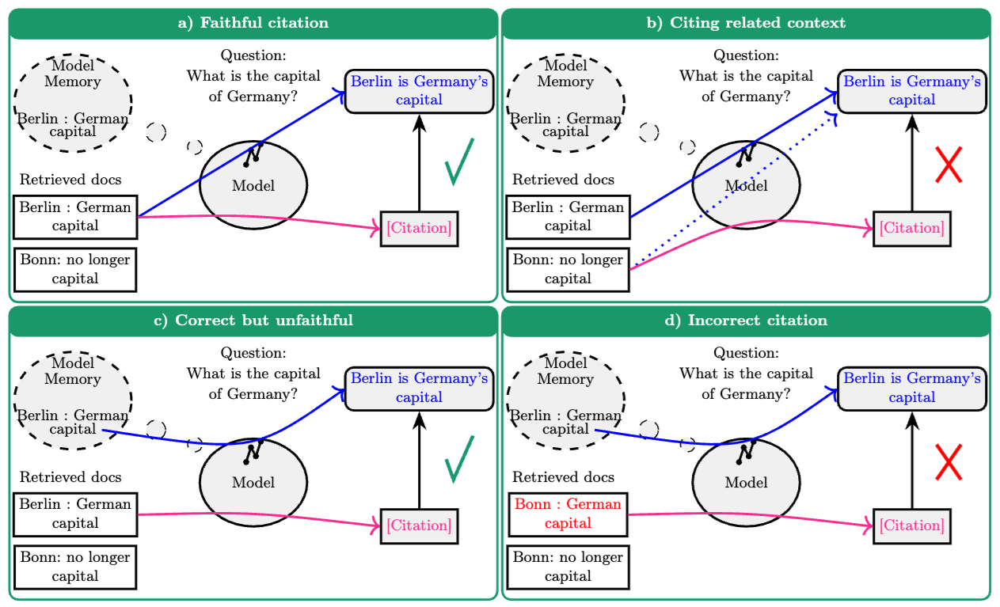

import AudioPlayer from "@site/src/components/AudioPlayer";

<AudioPlayer audioSrc={require("./audio.wav").default} />

<!--truncate-->

## Introduction

Retrieval-Augmented Generation (RAG) has emerged as a promising method to address the “hallucination” problem in large language models (LLMs) by grounding responses in external, traceable knowledge sources <a href="#arvix:1">[1]</a>
. By integrating retrieval mechanisms with generative capabilities, RAG systems produce more accurate, informative, and up-to-date outputs, making them especially powerful for question-answering and content creation tasks. However, a critical but often overlooked aspect is the ability to attribute claims to their original sources. Without proper citations, RAG becomes a "black box," undermining the trustworthiness and verifiability of its responses. While much of the existing work has focused on enhancing response quality, less attention has been paid to source attribution<a href="#arvix:2">[2]</a>.

:::tip
## In This Post You Will Learn

- Why **citations are critical** in RAG systems for improving trust, traceability, and reducing hallucinations.
- **Some approaches for implementing citations in content generation and RAG pipelines:** source-aware generation, inline citations, post-hoc attribution, and more.
- **How to build and implement in-line-text citation-aware RAG pipelines using:**
    - **LangChain** + FAISS for LLM-backed scholarly QA.
    - **LlamaIndex** for structured workflows and granular citations.
    - **Google’s Gemini API** with Google Search grounding for real-time web references.
:::

## Why are Citations Essential?

Retrieving external context is a proven strategy for reducing hallucinations and enhancing the reliability of generative AI outputs. However, surfacing relevant documents is only part of the equation—explicitly citing sources is critical for building user trust and enabling verification. Much of the existing research has focused on citation correctness—whether the cited document supports the claim—but correctness alone isn’t sufficient. To establish true credibility, we also need citation faithfulness, which ensures the cited content accurately reflects the intended meaning of the generated response.

Together, these two dimensions—correctness and faithfulness—are foundational to the trustworthiness, transparency, and usability of RAG systems. They support a range of key benefits:

- **Verifiability:** Allow users to trace claims back to original documents.
- **Trust:** Build user confidence by grounding outputs in identifiable sources.
- **Transparency and Explainability:** Help users understand where information comes from.
- **Debugging and Improvement:** Make it easier to audit and correct flawed generations.
- **Reduced Hallucinations:** Anchor responses in concrete evidence.
- **Respecting Intellectual Property:** Ensure proper attribution to original authors and sources.

While citations don’t guarantee the elimination of hallucinations, they play a crucial role in mitigating them by offering a transparent path to verify information and understand its original context. In the paper “Correctness is not Faithfulness in RAG Attributions” <a href="#arvix:2">[2]</a>, the authors emphasize the importance of distinguishing between citation correctness (does the source support the claim?) and citation faithfulness (does the citation reflect the actual meaning?). Their work calls for more nuanced evaluation metrics that go beyond simple correctness to better assess the quality and reliability of AI-generated citations.

This distinction is illustrated in the following figure:


*(a) Faithful citation: The model generates the correct answer ("Berlin is Germany's capital") based on a relevant retrieved document ("Berlin : German capital") and correctly cites that document. (b) Citing related context: The model generates the correct answer, likely based on the relevant document or its memory, but incorrectly cites a related but non-supporting retrieved document ("Bonn: no longer capital").(c) Correct but unfaithful: The model generates the correct answer using its internal memory, not the retrieved documents, but still cites a retrieved document ("Berlin : German capital") that happens to support the answer. The citation is unfaithful because the cited source wasn't the basis for the generation. (d) Incorrect citation: The model generates the correct answer, likely from memory, but incorrectly cites a retrieved document containing false information ("Bonn : German capital").*


## Implementing Citations in RAG Systems 

Common approaches to implementing citations in Retrieval-Augmented Generation (RAG) systems include source-aware generation, highlight-based attribution, post-hoc attribution, inline citations, and aggregated source lists. <a href="#arvix:1">[1]</a><a href="#arvix:1">[2]</a>

- **In source-aware generation**, the model is specifically designed or trained to associate facts with their respective source documents during answer generation. This may involve fine-tuning the model on examples that include citations or labeling retrieved text in the prompt to allow the model to reference those labels.

- **Highlight-based** attribution visually connects parts of the output to supporting sources using cues such as color-coding or tooltips. While this method enhances clarity, it requires precise alignment. Instead of merely inserting reference numbers, the system highlights sections of the answer to indicate their sources. For instance, certain sentences may be color-coded or underlined, with hover actions revealing excerpts from the original documents.

- **Post-hoc attribution** works by generating the answer first and adding citations afterward. In this strategy, the RAG system produces a response without citations and subsequently searches the retrieved documents for evidence to support each statement, integrating citations into the final output.

- **Inline citation** involves embedding references, such as “[1],” directly within the text, thereby improving traceability while necessitating well-structured prompts or additional training. This method is typically implemented by directing the model to insert citations during response generation. For example, a prompt might instruct the model to “include source numbers in brackets for the information you use,” leading to sentences that end with references like “[1]” or “[2]” corresponding to the source documents. This live citing method (sometimes termed “pre-hoc”) treats citations as an integral part of the answer.

- **Aggregated source** lists provide a summary of all sources utilized without integrating citations directly into the text. In this approach, the RAG system presents the answer followed by a bullet list or section titled "Sources," detailing all relevant documents that informed the answer, though it does not specify which fact corresponds to which source within the text.

In the following sections, we will explore three distinct approaches for implementing RAG applications with In-line citations using 1) Google’s Generative AI SDK, Gemini and Google Search grounding, 2) LangChain, and 3) LlamaIndex. Each method offers unique features and trade-offs tailored to different use cases and preferences.

## Hands-on Implementations (In-text) Citations

### LangChain example 

In the following example, we implement a pipeline that searches, downloads, semantically processes, and queries scientific papers from arXiv, leveraging vector search and a Large Language Model (LLM) to generate contextual responses with citations:

### ✅ Here is all the code:

```python
import itertools
import typing
from pathlib import Path
import arxiv
import os
from dotenv import load_dotenv

from langchain_community.document_loaders import PyPDFLoader
from langchain_community.vectorstores import FAISS
from langchain_openai import OpenAIEmbeddings, ChatOpenAI
from langchain_experimental.text_splitter import SemanticChunker
from langchain_core.output_parsers import StrOutputParser
from langchain_core.prompts import PromptTemplate
from rich import print

# Load environment variables from .env file
load_dotenv()

# Constants
FAISS_INDEX_PATH = Path("faiss_index")
DOWNLOAD_FOLDER = Path("downloads")


def fetch_arxiv_papers(query: str, max_results: int = 5) -> list[arxiv.Result]:
    search = arxiv.Search(query=query, max_results=max_results, sort_by=arxiv.SortCriterion.Relevance)
    return list(arxiv.Client().results(search))


def process_papers(results: list[arxiv.Result], download_folder: Path) -> list:
    openai_embeddings = OpenAIEmbeddings()
    text_splitter = SemanticChunker(embeddings=openai_embeddings)
    download_folder.mkdir(exist_ok=True, parents=True)
    documents = []

    for index, result in enumerate(results):
        pdf_path = result.download_pdf(dirpath=str(download_folder))
        pdf_docs = PyPDFLoader(pdf_path).load_and_split(text_splitter)

        for doc in pdf_docs:
            doc.metadata.update({
                "title": result.title,
                "authors": [author.name for author in result.authors],
                "entry_id": result.entry_id.split('/')[-1],
                "year": result.published.year,
                "url": result.entry_id,
                "ref": f"[{index + 1}]"
            })
        documents.extend(pdf_docs)

    return documents


def load_or_create_faiss_index(query: str, index_path: Path, download_folder: Path) -> FAISS:
    openai_embeddings = OpenAIEmbeddings()

    if index_path.exists():
        print("Loading existing FAISS index...")
        return FAISS.load_local(str(index_path), openai_embeddings, allow_dangerous_deserialization=True)

    print("Creating a new FAISS index...")
    documents = process_papers(fetch_arxiv_papers(query), download_folder)
    faiss_index = FAISS.from_documents(documents, openai_embeddings)
    faiss_index.save_local(str(index_path))
    return faiss_index


def search_similar_documents(faiss_index: FAISS, query: str, top_k: int = 20) -> list:
    return faiss_index.similarity_search(query, k=top_k)


def generate_response(context_docs: list, question: str) -> str:
    sorted_docs = sorted(context_docs, key=lambda doc: doc.metadata.get("ref", "Unknown"))
    formatted_context = [
        f"{doc.metadata['ref']} {doc.metadata['title']}: {doc.page_content}" for doc in sorted_docs
    ]

    prompt_template = PromptTemplate(
        template="""
        Write a blog post based on the user query.
        When referencing information from the context, cite the appropriate source(s) using their corresponding numbers.
        Each source has been provided with a number and a title.
        Every answer should include at least one source citation.
        If none of the sources are helpful, indicate that.

        ------
        {context}
        ------
        Query: {query}
        Answer:
        """,
        input_variables=["query", "context"]
    )

    model = ChatOpenAI(model="gpt-4o-mini")
    parser = StrOutputParser()
    chain = prompt_template | model | parser

    return chain.invoke({"context": formatted_context, "query": question})


def main():
    query = "hallucination in LLMs"
    question = "How to mitigate hallucination ?"

    faiss_index = load_or_create_faiss_index(query, FAISS_INDEX_PATH, DOWNLOAD_FOLDER)
    relevant_docs = search_similar_documents(faiss_index, question)
    response = generate_response(relevant_docs, question)

    print("\nGenerated Response:\n", response)

    bibliography = "\n\n### References\n"
    sorted_docs = sorted(relevant_docs, key=lambda doc: doc.metadata.get("ref", "Unknown"))

    for doc_key, documents in itertools.groupby(sorted_docs, key=lambda doc: doc.metadata.get("ref", "Unknown")):
        doc = next(documents)
        bibliography += (
            f"{doc.metadata.get('ref', 'Unknown')} {doc.metadata.get('title', 'Unknown')}, "
            f"{', '.join(doc.metadata.get('authors', 'Unknown'))}, arXiv {doc.metadata.get('entry_id', 'Unknown')}, "
            f"{doc.metadata.get('year', 'Unknown')}. {doc.metadata.get('url', 'Unknown')}\n"
        )
    print(bibliography)


if __name__ == "__main__":
    main()
```


This workflow uses LangChain, OpenAI's models, FAISS for vector storage, and arXiv's Python client. Let’s break it down:

### Key Steps:

#### 1. **Environment Setup and Imports**
The code imports standard libraries (`os`, `itertools`, `pathlib`, etc.), third-party tools (`arxiv`, `dotenv`), and key LangChain modules for PDF loading, text splitting, embeddings, LLM interaction, and vector storage. It also loads API keys securely via environment variables.

#### 2. **Query arXiv for Relevant Papers**
```python
fetch_arxiv_papers()
```
Uses the `arxiv` Python package to search for academic papers matching a query string. Returns a list of arXiv `Result` objects.

#### 3. **Download and Process Papers**
```python
process_papers()
```
Downloads the PDF files, splits them into semantically meaningful text chunks using OpenAI embeddings, and attaches rich metadata such as title, authors, publication year, and a reference number.

#### 4. **Create or Load FAISS Index**
```python
load_or_create_faiss_index()
```
Checks whether a local FAISS index already exists. If not, it creates one by embedding the paper chunks and saving the index locally.

#### 5. **Semantic Search over the Indexed Chunks**
```python
search_similar_documents()
```
Takes a user query and searches for the most semantically similar document chunks using vector similarity (k-nearest neighbors search).

#### 6. **Generate an LLM-Based Answer with Citations**
```python
generate_response()
```
Uses a prompt template and an OpenAI Chat model (`gpt-4o-mini`) to generate a response grounded in the top retrieved documents, including source references inline using numbered citations.

#### 7. **Main Program Logic**
```python
main()
```
Puts all the above steps together to:
- Search and download papers about *hallucinations in LLMs*
- Answer the question: *How to mitigate hallucination?*
- Print the generated response
- Print a formatted bibliography of the cited papers

### LlamaIndex example <a href="#llamaindex:1">[3]</a>

Following with hands-on implementations, let's explore how to build a citation-aware query engine using LlamaIndex. This implementation starts by retrieving relevant text chunks from a set of documents, splits them into citable segments, and uses a Large Language Model (LLM) to synthesize a well-cited answer to a given query.


### ✅ Here is all the code:

```python
import asyncio
import logging
from typing import List, Union

from dotenv import load_dotenv
from llama_index.core import SimpleDirectoryReader, VectorStoreIndex
from llama_index.core.workflow import Context, Workflow, StartEvent, StopEvent, step, Event
from llama_index.llms.openai import OpenAI
from llama_index.embeddings.openai import OpenAIEmbedding
from llama_index.core.schema import MetadataMode, NodeWithScore, TextNode
from llama_index.core.response_synthesizers import ResponseMode, get_response_synthesizer
from llama_index.core.node_parser import SentenceSplitter
from llama_index.core.prompts import PromptTemplate

# Load environment variables
load_dotenv(verbose=True)

# Configure logging
logging.basicConfig(level=logging.INFO)
logger = logging.getLogger(__name__)

# Prompt templates for citation-based QA
CITATION_QA_TEMPLATE = PromptTemplate(
    "Please provide an answer based solely on the provided sources. "
    "When referencing information from a source, cite the appropriate source(s) using their corresponding numbers. "
    "Every answer should include at least one source citation. "
    "Only cite a source when you are explicitly referencing it. "
    "If none of the sources are helpful, you should indicate that. \n"
    "Example:\n"
    "Source 1:\nThe sky is red in the evening and blue in the morning.\n"
    "Source 2:\nWater is wet when the sky is red.\n"
    "Query: When is water wet?\n"
    "Answer: Water will be wet when the sky is red [2], which occurs in the evening [1].\n"
    "Now it's your turn. Below are several numbered sources:\n"
    "{context_str}\nQuery: {query_str}\nAnswer: "
)

CITATION_REFINE_TEMPLATE = PromptTemplate(
    "Please refine the existing answer based solely on the provided sources. "
    "Cite sources where necessary, following this format:\n"
    "Example:\n"
    "Existing answer: {existing_answer}\n"
    "{context_msg}\n"
    "Query: {query_str}\nRefined Answer: "
)

DEFAULT_CITATION_CHUNK_SIZE = 512
DEFAULT_CITATION_CHUNK_OVERLAP = 20


class RetrieverEvent(Event):
    """Event triggered after document retrieval."""

    nodes: List[NodeWithScore]


class CreateCitationsEvent(Event):
    """Event triggered after creating citations."""

    nodes: List[NodeWithScore]


class CitationQueryEngineWorkflow(Workflow):
    """Workflow for processing queries with retrieval-augmented generation (RAG)."""

    @step
    async def retrieve(self, ctx: Context, ev: StartEvent) -> Union[RetrieverEvent, None]:
        """Retrieve relevant nodes based on the query."""
        query = ev.get("query")
        if not query:
            logger.warning("No query provided.")
            return None

        logger.info(f"Querying database: {query}")

        await ctx.set("query", query)

        if ev.index is None:
            logger.error("Index is empty. Load documents before querying!")
            return None

        retriever = ev.index.as_retriever(similarity_top_k=2)
        nodes = retriever.retrieve(query)

        logger.info(f"Retrieved {len(nodes)} nodes.")
        return RetrieverEvent(nodes=nodes)

    @step
    async def create_citation_nodes(self, ev: RetrieverEvent) -> CreateCitationsEvent:
        """Create granular citation nodes from retrieved text chunks."""
        nodes = ev.nodes
        new_nodes: List[NodeWithScore] = []

        text_splitter = SentenceSplitter(
            chunk_size=DEFAULT_CITATION_CHUNK_SIZE,
            chunk_overlap=DEFAULT_CITATION_CHUNK_OVERLAP,
        )

        for node in nodes:
            text_chunks = text_splitter.split_text(
                node.node.get_content(metadata_mode=MetadataMode.NONE)
            )

            for idx, text_chunk in enumerate(text_chunks, start=len(new_nodes) + 1):
                text = f"Source {idx}:\n{text_chunk}\n"

                new_node = NodeWithScore(
                    node=TextNode.model_validate(node.node), score=node.score
                )
                new_node.node.text = text
                new_nodes.append(new_node)

        logger.info(f"Created {len(new_nodes)} citation nodes.")
        return CreateCitationsEvent(nodes=new_nodes)

    @step
    async def synthesize(self, ctx: Context, ev: CreateCitationsEvent) -> StopEvent:
        """Generate an AI response based on retrieved citations."""
        llm = OpenAI(model="gpt-4o-mini")
        query = await ctx.get("query", default=None)

        synthesizer = get_response_synthesizer(
            llm=llm,
            text_qa_template=CITATION_QA_TEMPLATE,
            refine_template=CITATION_REFINE_TEMPLATE,
            response_mode=ResponseMode.COMPACT,
            use_async=True,
        )

        response = await synthesizer.asynthesize(query, nodes=ev.nodes)
        return StopEvent(result=response)


async def run_workflow():
    """Initialize the index and run the query workflow."""
    logger.info("Loading documents...")
    documents = SimpleDirectoryReader("downloads").load_data()

    index = VectorStoreIndex.from_documents(
        documents=documents,
        embed_model=OpenAIEmbedding(model_name="text-embedding-3-small"),
    )

    logger.info("Running citation query workflow...")
    workflow = CitationQueryEngineWorkflow()
    result = await workflow.run(query="Write a blog post about agents?", index=index)

    bibliography = "\n\n### References\n"
    for node in result.source_nodes:
        bibliography += f"{node.get_text()}\n"
    print(bibliography)

    return result


if __name__ == "__main__":
    result = asyncio.run(run_workflow())
    print(result)
```

### Key Steps:

#### 1. **Environment Setup and Logging Configuration**
The code loads environment variables from `.env` using `dotenv`, and configures logging to help track events during the workflow execution.

```python
load_dotenv(verbose=True)
logging.basicConfig(level=logging.INFO)
```

#### 2. **Define Prompt Templates**
Two prompt templates are defined for instructing the LLM:
- `CITATION_QA_TEMPLATE`: Generates answers with numbered citations based on the provided context.
- `CITATION_REFINE_TEMPLATE`: Refines an existing answer with additional citation context.

These templates ensure the model cites only relevant sources and produces trustworthy output.

#### 3. **Declare Custom Events**
Custom `Event` classes (`RetrieverEvent`, `CreateCitationsEvent`) are defined to structure the flow of data across the steps of the workflow.


#### 4. **Build the Citation Query Workflow**
`CitationQueryEngineWorkflow` is a subclass of `Workflow` with three main `@step`s:

- **`retrieve()`**:  
  Retrieves top-k relevant document nodes from a vector index based on the user's query using similarity search.

- **`create_citation_nodes()`**:  
  Splits the retrieved chunks into smaller, clearly numbered sources (e.g., `Source 1`, `Source 2`), ensuring each text chunk can be referenced independently.

- **`synthesize()`**:  
  Generates a final, citation-rich response using the GPT-4o-mini model via the LlamaIndex synthesizer tools.

#### 5. **Execute the Workflow**
The `run_workflow()` function loads all documents from the `downloads/` directory and builds a `VectorStoreIndex` using OpenAI embeddings. It then runs the query engine on the question:
**"Write a blog post about agents?"**

Finally, it prints both the result and a nicely formatted bibliography of all cited text chunks.


### Using Grounding with Google Search in the Gemini API example

Finally, in this last example, you will learn how to leverage Google Search capabilities within the Gemini API to generate content with inline citations. This approach combines the power of Gemini’s 2.0 with real-time web search to produce informative, grounded responses with proper attributions.


### ✅ Here is all the code:

```python
import itertools
from typing import Optional

from dotenv import load_dotenv
from pydantic import BaseModel
from rich import print

from google import genai
from google.genai.types import (
    GenerateContentConfig,
    Tool,
    GoogleSearch,
    GroundingChunk
)

load_dotenv()

class Citation(BaseModel):
    """Represents a citation extracted from the Gemini grounding metadata."""
    title: str
    score: float
    link: str
    chunk_index: int
    chunk_text: Optional[str] = None
    start_index: Optional[int] = None
    end_index: Optional[int] = None


def generate_content(prompt: str, model: str) -> genai.types.GenerateContentResponse:
    client = genai.Client()
    return client.models.generate_content(
        model=model,
        contents=prompt,
        config=GenerateContentConfig(
            response_modalities=["TEXT"],
            tools=[Tool(google_search=GoogleSearch())],
        ),
    )


def extract_citations(response: genai.types.GenerateContentResponse) -> list[Citation]:
    citations = []
    grounding_metadata = response.candidates[0].grounding_metadata
    for support in grounding_metadata.grounding_supports:
        for idx, score in zip(support.grounding_chunk_indices, support.confidence_scores):
            chunk: GroundingChunk = grounding_metadata.grounding_chunks[idx]
            citations.append(
                Citation(
                    title=chunk.web.title,
                    link=chunk.web.uri,
                    score=score,
                    chunk_index=idx,
                    chunk_text=support.segment.text,
                    start_index=support.segment.start_index,
                    end_index=support.segment.end_index,
                )
            )
    return citations


def inject_citations_into_text(text: str, citations: list[Citation]) -> str:
    citations.sort(key=lambda x: (x.start_index, x.end_index))
    offset = 0
    for (start, end), group in itertools.groupby(citations, key=lambda x: (x.start_index, x.end_index)):
        group_list = list(group)
        indices = ",".join(str(c.chunk_index + 1) for c in group_list)
        citation_str = f"[{indices}]"
        text = text[:end + offset] + citation_str + text[end + offset:]
        offset += len(citation_str)
    return text


def format_citation_section(citations: list[Citation]) -> str:
    result = "\n\n**Citations**\n\n"
    sorted_citations = sorted(citations, key=lambda x: x.chunk_index)
    for chunk_index, group in itertools.groupby(sorted_citations, key=lambda x: x.chunk_index):
        citation = list(group)[0]
        result += f"[{chunk_index + 1}] {citation.title} - {citation.link}\n"
    return result


def main():
    MODEL_NAME = "gemini-2.0-flash"
    response = generate_content("Write a blog post about Agents", MODEL_NAME)
    citations = extract_citations(response)

    generated_text = response.text
    final_text = inject_citations_into_text(generated_text, citations)
    final_text += format_citation_section(citations)
    print(final_text)


if __name__ == '__main__':
    main()
```

### Key Steps:

#### 1. **Set Up and Define the Citation Schema**
```python
class Citation(BaseModel)
```
Defines a schema for handling citation information, including title, score, link, and text span indices for precise inline placement.

#### 2. **Call Gemini’s Multimodal API with Google Search Tooling**
```python
generate_content()
```
This function generates content using Gemini (e.g., `gemini-2.0-flash`) and includes a `GoogleSearch` tool, enabling grounded web references.

#### 3. **Extract Grounded Citations**
```python
extract_citations()
```
Pulls out metadata like source titles, URLs, and confidence scores from the model's response using Gemini’s `grounding_supports`.

#### 4. **Inject Inline Citations**
```python
inject_citations_into_text()
```
Adds numbered citation markers like `[1]`, `[2]`, etc., directly into the generated text using the start and end positions returned by Gemini.


#### 5. **Format the Citation Section**
```python
format_citation_section()
```
Generates a clean, markdown-style bibliography list at the end of the post, matching each inline marker with its source.

#### 6. **Main Execution**
```python
main()
```
Combines everything: generates content about "Agents", extracts and injects citations, and prints the final, publication-ready blog post with proper attributions.

## Key Differences and Summary

- **Grounding with Google Search in the Gemini API** enhances the accuracy and freshness of model responses by leveraging Google’s real-time search and grounding capabilities. It’s straightforward to implement but is tightly integrated with Google’s Gemini models family.

- **LangChain:** Provides a modular framework for building RAG pipelines. Offers flexibility in choosing components (document loaders, text splitters, vector stores, LLMs). Requires more manual setup, but allows for greater customization. Focuses on creating a reference string in the metadata and using that in the prompt.
- **LlamaIndex:** Offers higher-level abstractions for RAG, including workflows and specialized components for citation handling. Emphasizes creating granular citation nodes for precise referencing. Uses very explicit prompt templates to guide the LLM.

All three approaches achieve the same goal – generating responses with citations – but they use different mechanisms and levels of abstraction. The choice of which to use depends on your specific needs and preferences. The most important common thread is the careful management of metadata to track the source of information.

## Conclusion

In the era of AI-generated content, trust is everything. Retrieval-Augmented Generation has unlocked new levels of intelligence and context-awareness, but without clear, faithful citations, even the most accurate answers remain suspect. Citations are not just a safeguard against hallucinations—they are the bridge between AI and human understanding, offering transparency, accountability, and traceability. This post has walked through practical, hands-on implementations using LangChain, LlamaIndex, and Google’s Gemini API to demonstrate that citation-aware RAG isn't just a research ideal—it’s an achievable standard. As builders and researchers, the responsibility is ours to push beyond plausible-sounding responses and deliver outputs that are grounded, explainable, and verifiably true. The future of reliable AI starts with showing your sources.

All the code snippets and examples in this post are available on GitHub following this link:
[llm-app-patterns](https://github.com/haruiz/llm-app-patterns/tree/main)


**References**
<ul>
 <li><a id="arvix:1" href="https://arxiv.org/abs/2410.11217" target="_blank">[1] Qian, H., Fan, Y., Zhang, R., & Guo, J. (2024, October 15). On the Capacity of Citation Generation by Large Language Models</a></li>
 <li><a id="arvix:2" href="https://arxiv.org/abs/2412.18004" target="_blank">[2] Wallat, J., Heuss, M., Maarten, D. R., & Anand, A. (2024, December 23). Correctness is not Faithfulness in RAG Attributions</a></li>
<li>
<a id="llamaindex:1" href="https://docs.llamaindex.ai/en/stable/examples/workflow/citation_query_engine/" target="_blank">[3] LlamaIndex Documentation: Build RAG with in-line citations</a>
</li>
</ul>
