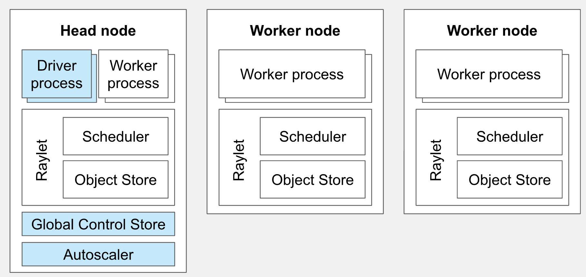
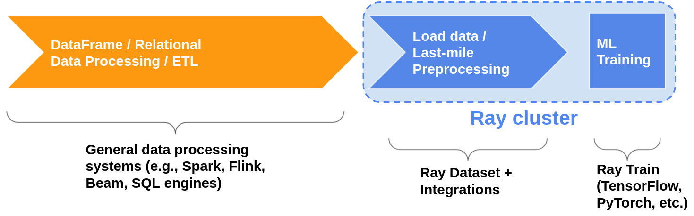
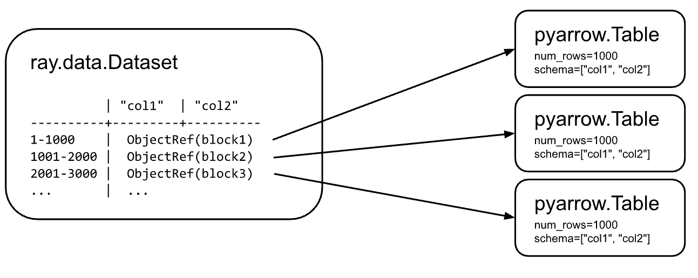
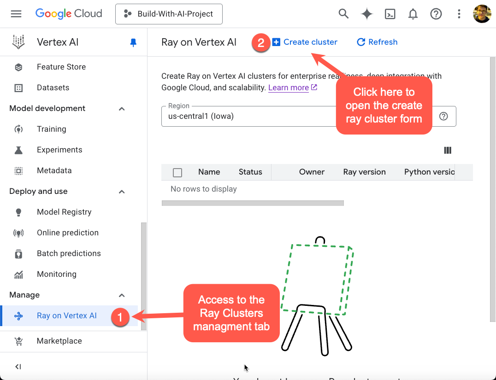
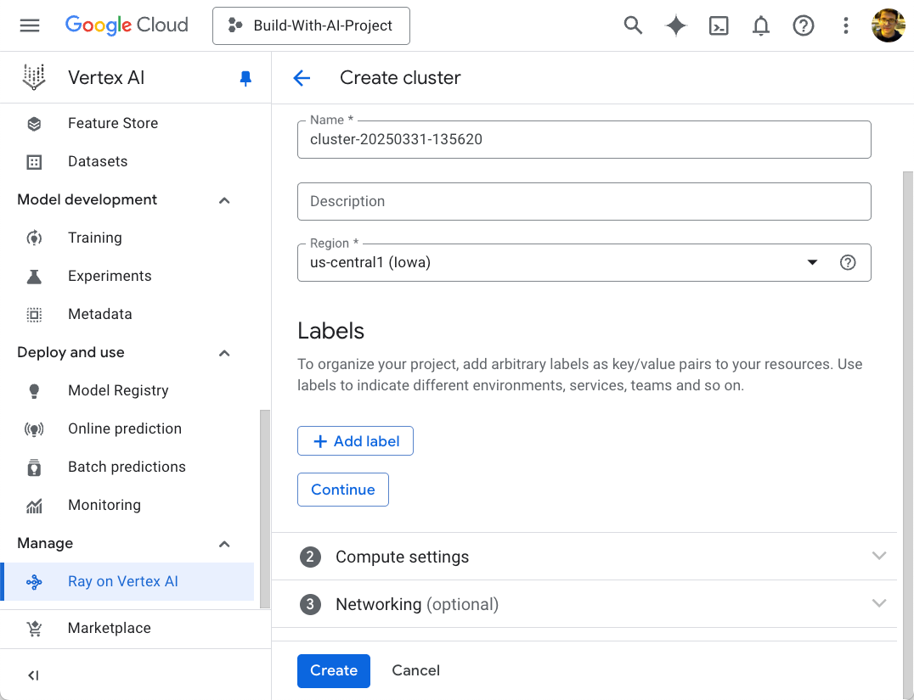
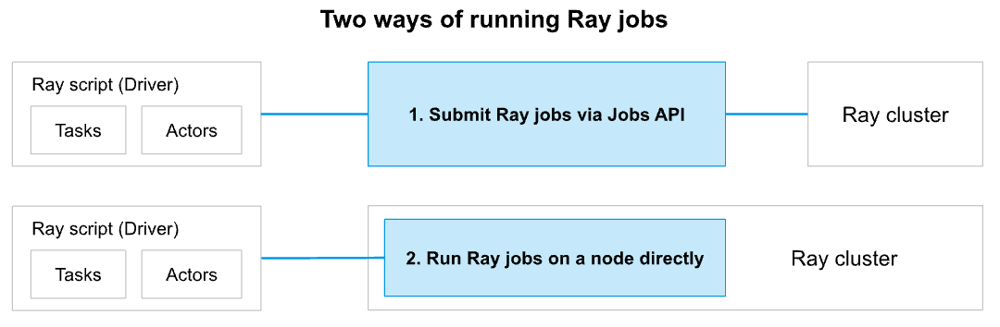

import AudioPlayer from "@site/src/components/AudioPlayer";

<AudioPlayer audioSrc={require("./audio.wav").default} />

<!--truncate-->

### Introduction 

As AI and machine learning workloads continue to grow in scale and complexity, the need for flexible and efficient distributed computing frameworks becomes increasingly important. Ray is an open-source framework built to simplify the development and execution of distributed applications using familiar Python syntax.

When combined with the power and scalability of Google Cloud Platform (GCP), particularly Vertex AI—Ray enables seamless orchestration of large-scale data science and machine learning workflows, from local prototyping to full production deployments.

This post introduces the fundamentals of Ray and walks you through how to deploy and manage Ray clusters on GCP using Vertex AI, empowering you to run scalable and efficient distributed workloads with minimal operational overhead.

:::tip 
## In This Post You Will Learn
- What Ray is and how it supports scalable Python and AI applications
- Core components of a Ray cluster: head nodes, worker nodes, autoscaler, and scheduler
- How to configure and manage Ray clusters on Google Cloud Platform with Vertex AI
- How Ray handles distributed task execution and resource allocation across nodes and GPUs
- How to submit jobs and interact with Ray clusters using the Ray Job API and Python SDK
- Best practices for using Ray Datasets to efficiently ingest, transform, and serve distributed data
- Practical examples for configuring autoscaling, deploying workloads, and optimizing cluster usage
:::

### What is Ray?

**Ray** is an open-source, unified framework engineered to enable scalable and distributed computing for AI and Python-based applications. It provides an efficient and extensible compute layer for executing parallel and distributed workloads, abstracting the complexities typically associated with distributed systems such as resource management, orchestration, and fault tolerance.

By decoupling infrastructure concerns from application logic, Ray allows developers and researchers to seamlessly scale individual components or end-to-end machine learning (ML) pipelines—from prototyping on a local machine to executing large-scale workloads across multi-node, multi-GPU clusters.
Ray’s modular and composable architecture supports diverse roles across the machine learning and data science lifecycle, delivering specific advantages for each:

- **For Data Scientists:** Ray enables transparent parallelization of data preprocessing, feature extraction, model training, and evaluation workflows across heterogeneous compute resources, without requiring in-depth knowledge of distributed systems. Its native integration with popular Python libraries (e.g., NumPy, Pandas, Scikit-learn, TensorFlow, PyTorch) ensures smooth adoption into existing ecosystems.

- **For Machine Learning Engineers:** Ray facilitates the development of production-grade ML platforms through unified APIs that allow the same codebase to scale seamlessly from a developer's laptop to large-scale clusters. This consistency accelerates the deployment lifecycle, reduces operational overhead, and ensures reproducibility in model training and experimentation workflows.

- **For Systems Engineers and DevOps Teams:** Ray handles lower-level system functions including task scheduling, resource allocation, fault tolerance, and elastic scaling. It also supports Kubernetes-native deployments, making it easier to integrate with modern cloud-native infrastructure and CI/CD pipelines.

### Ray's Core Components
Ray enables seamless scaling of high-performance analytical workloads—from a single laptop to a large, distributed cluster. You can get started locally with a simple `ray.init()` call during development. However, to scale applications across multiple nodes in production, you'll need to *deploy a Ray cluster*.

A **Ray cluster** is a collection of nodes working together to execute tasks and manage data in a distributed environment. Each cluster consists of a **head node** and one or more **worker nodes**, each with distinct responsibilities that enable efficient and scalable execution.

#### Head Node

The **head node** acts as the central coordinator of the cluster. It runs the core components responsible for orchestration and cluster management, including:

- **Global Control Store (GCS):** A distributed metadata store that tracks task specifications, function definitions, object locations, and scheduling events. GCS ensures scalability and fault tolerance across the cluster.
- **Autoscaler:** A daemon process running on the head node—or as a sidecar container within the head pod in Kubernetes environments—that continuously monitors resource utilization and dynamically adjusts the number of worker nodes in response to real-time workload demands, enabling elastic cluster scaling both upward and downward as needed.
- **Driver Processes:** Entry points for Ray applications. Each driver launches and manages a job, which may include thousands of distributed tasks and actors.

While the head node is capable of executing tasks and actors, in larger clusters it's typically configured to focus solely on coordination duties to optimize performance and avoid resource contention.

#### Worker Nodes

**Worker nodes** are dedicated to executing user-defined tasks and actors. They do not run any cluster management components, allowing them to fully commit their resources to computation. Worker nodes participate in distributed scheduling and contribute to Ray's object store, which enables efficient sharing of intermediate results across tasks.

The follwing figure illustrates the core components of a Ray cluster:


***Figure 1: Ray Cluster Components***

By integrating these core components, Ray delivers a flexible and powerful framework for distributed computing—capable of supporting diverse workloads such as large-scale data processing, machine learning pipelines, and real-time inference.

:::info
Ray nodes are implemented as pods when running on Kubernetes.
:::

### From Cores to Clusters: Understanding Worker Distribution and Computation Scaling

As mentioned, in a Ray cluster, worker nodes are responsible for executing tasks and actors, utilizing the available computational resources such as CPU cores and GPUs. The distribution of workloads across these resources is managed through Ray's resource allocation mechanisms. The resource allocation is managed by the **Ray Scheduler**, which assigns tasks and actors to nodes based on specified resource requirements.

- **Resource Specification:**

Developers can specify worker resource requirements using the @ray.remote decorator and ray_actor_options to allocate CPUs, GPUs, and custom resources. The scheduler then ensures tasks are executed on nodes with sufficient resources to optimize cluster performance.

```python
import ray

# defining task resources using the @ray.remote decorator
@ray.remote(num_cpus=2, num_gpus=1)
def my_function():
    # Function implementation
    pass

@ray.remote(num_cpus=1)
class MyActor:
    # Actor implementation
    pass
```

In this example, `my_function` requires 2 CPU cores and 1 GPU, while `MyActor` requires 1 CPU core. By default, if resource requirements are not specified, Ray assigns 1 CPU core to each task or actor.

- **Fractional Resource Allocation:**

Additionally, ray supports fractional resource specifications, allowing tasks or actors to utilize portions of a resource. This is particularly useful for lightweight tasks or when sharing resources among multiple processes. For example, to allocate half a CPU core to a task

```Python
# defining a task with fractional CPU allocation
@ray.remote(num_cpus=0.5)
def lightweight_task():
    # Task implementation
    pass
```

Similarly, if two actors can share a single GPU:

```Python
# defining actors with shared GPU allocation
@ray.remote(num_gpus=0.5)
class SharedGPUActor:
    # Actor implementation
    pass
```

This configuration allows for efficient utilization of resources by enabling multiple processes to share the same hardware components.

- **Node Resource Configuration:**

When initializing a Ray cluster, you can define the resources available on each node. By default, Ray detects the number of CPU cores and GPUs on a machine and assigns them as available resources. However, you can override these defaults during initialization:[Max Pumperla](https://maxpumperla.com/learning_ray/ch_02_ray_core/)

```python
import ray

ray.init(num_cpus=4, num_gpus=2, resources={"custom_resource": 1})
````
This command starts a Ray node with 4 CPU cores, 2 GPUs, and an additional custom resource labeled "custom_resource" with a quantity of 1. 

- **Resource Management in Distributed Environments:**

In distributed setups, such as those using Kubernetes with KubeRay, resource requests and limits can be specified in the pod templates to ensure appropriate allocation:[Medium+1Ray+1](https://medium.com/google-cloud/simplifying-ray-and-distributed-computing-2c4b5ca72ad8)

```yaml
resources:
  limits:
    nvidia.com/gpu: 1
  requests:
    memory: "4Gi"
    cpu: "2"
```

This configuration requests 2 CPU cores, 4 GiB of memory, and 1 GPU for the pod, ensuring that the Ray worker has the necessary resources allocated by the Kubernetes scheduler.

By explicitly defining resource requirements and configurations, Ray effectively manages the distribution of tasks and actors across CPU cores, processes, machines, and GPUs, optimizing the utilization of computational resources within the cluster.

### Ray Scaling mode

Ray is designed to scale Python applications in two ways: across multiple machines (**horizontal scaling**) and within a single machine (**vertical scaling**).

1. **Horizontal Scaling:** Ray seamlessly expands applications from a single node to a cluster of machines. By dynamically distributing tasks across nodes, it enables efficient parallel processing—particularly valuable for large-scale machine learning tasks like distributed training and hyperparameter tuning.
2. **Vertical Scaling:** On a single machine, Ray maximizes resource utilization by parallelizing tasks across multiple CPU cores and GPUs. This optimization enhances performance for operations like data preprocessing and model inference.

Through these complementary scaling strategies, Ray offers the flexibility to handle varying computational demands, making it ideal for diverse AI and machine learning applications.

### How Data Is Shared Across Worker Nodes

In **Ray**, efficient **data sharing and distributed computation** are foundational to its performance. At the heart of this is the **Ray Object Store**, a distributed shared-memory system designed to facilitate fast and scalable data sharing across the cluster.  Each node in a Ray cluster maintains its **own local object store**, which stores immutable objects—such as datasets or model parameters—used by Ray tasks and actors. This design allows for **zero-copy access** within a node, significantly reducing serialization overhead and memory duplication. When multiple workers on the same node need to access the same object, they can do so directly from shared memory, leading to highly efficient **intra-node data sharing**. (https://www.anyscale.com/blog/ray-datasets-for-machine-learning-training-and-scoring)

However, when data needs to be accessed across nodes (**inter-node sharing**), Ray’s **distributed scheduler** comes into play. It orchestrates the transfer by serializing the object on the source node, transmitting it over the network, and deserializing it into the object store on the destination node. To avoid unnecessary data movement and associated costs, Ray incorporates **locality-aware scheduling**—a strategy where tasks are preferentially scheduled on nodes where the needed data is already present. This greatly improves system performance and reduces latency.

Ray also provides a high-level API for data handling through its [**Datasets**](https://www.anyscale.com/blog/ray-datasets-for-machine-learning-training-and-scoring) module, which serves as the primary user-facing Python interface for working with distributed data.

At its core, **Ray Datasets** represent a **distributed dataset abstraction**, where the underlying data is partitioned into blocks that are distributed across the Ray cluster and stored in distributed memory. This architecture enables parallelism by design.

Each block of data can be loaded in parallel by worker tasks, with each task pulling a block (e.g., from cloud storage like S3) and storing it in the local object store of its node. The client-side `Dataset` object maintains lightweight references to these distributed blocks, enabling efficient tracking and manipulation without needing to move data unnecessarily. When operations are applied to the `Dataset`, they are executed in parallel across the distributed blocks—allowing scalable data transformations and preprocessing workflows.

A typical usage pattern for Ray Datasets involves:

1. **Creating** a `Dataset` from external storage or in-memory data.
2. **Applying** transformations using parallel operations (e.g., `map`, `filter`, `split`, `groupby`).
3. **Consuming** the processed dataset by either writing it to external storage or feeding it into training and scoring pipelines.

:::note
As it is shown in the figure 3, the **Ray Datasets API** is not designed to replace general-purpose data processing frameworks like Spark. Instead, it serves as the **last-mile bridge** between upstream ETL pipelines and **distributed applications running on Ray**.

This bridging role becomes especially powerful when combined with **Ray-native DataFrame libraries** during the data processing stage. By keeping data in memory across stages, you can seamlessly run an **end-to-end data-to-ML pipeline entirely within Ray**, without the overhead of writing intermediate results to external storage.

In this architecture, **Ray acts as the universal compute substrate**, and Datasets function as the **distributed data backbone**, connecting each stage of the pipeline—from data ingestion and transformation to training and inference—with high efficiency and flexibility.
:::


***Figure 2: Ray Data Ingestion Pipeline***

### Blocks

A **block** is the fundamental unit of data storage and transfer in **Ray Data**. Each block holds a disjoint subset of rows and is stored in Ray’s **shared-memory object store**, enabling efficient parallel loading, transformation, and distribution across the cluster.

Blocks can contain data of any modality—such as text, binary data (e.g., images), or numerical arrays. However, the full capabilities of Ray Datasets are best realized with **tabular data**. In this case, each block represents a **partition of a distributed table**, internally stored as an **Apache Arrow Table**, forming a highly efficient, columnar, distributed Arrow dataset.

The figure below illustrates a dataset composed of three blocks, each containing 1,000 rows. The `Dataset` object itself resides in the process that initiates execution (typically the **driver process**), while the blocks are stored as immutable objects in the Ray object store, distributed across the cluster.


***Figure 3: Ray Dataset Blocks***

### **Data format compatibility**

Ray Datasets supports a wide range of **popular tabular file formats**—including **CSV**, **JSON**, and **Parquet**—as well as various **storage backends** like local disk, **Amazon S3**, **Google Cloud Storage (GCS)**, **Azure Blob Storage**, and **HDFS**. This broad compatibility is made possible by **Arrow’s I/O layer**, which provides a unified and efficient interface for reading and writing data.

In addition to tabular data, Ray Datasets also supports **parallel reads and writes** of **NumPy arrays**, **text**, and **binary files**, enabling seamless ingestion of multi-modal datasets.

Together, this flexible I/O support and Ray’s scalable execution engine make Datasets a powerful tool for **efficiently loading large-scale data** into your cluster—ready for transformation, training, or serving.

```python
# Read structured data from disk, cloud storage, etc.
ray.data.read_parquet("s3://path/to/parquet")
ray.data.read_json("...")
ray.data.read_csv("...")
ray.data.read_text("...")

# Read tensor / image / file data.
ray.data.read_numpy("...")
ray.data.read_binary_files("...")

# Create from in-memory objects.
ray.data.from_objects([list, of, python, objects])
ray.data.from_pandas([list, of, pandas, dfs])
ray.data.from_numpy([list, of, numpy, arrays])
ray.data.from_arrow([list, of, arrow, tables])
```

### Seamless Data Framework Compatibility

Beyond just storage I/O, **Ray Datasets** supports **bidirectional in-memory data exchange** with a wide range of popular data frameworks—making it easy to integrate into your existing workflows.

When frameworks like **Spark**, **Dask**, **Modin**, or **Mars** are run on Ray, Datasets can interact directly with them in memory, enabling efficient data sharing without unnecessary serialization or disk I/O. For smaller-scale, local data operations, Datasets also works smoothly with **Pandas** and **NumPy**.

To simplify data loading into machine learning models, Ray Datasets includes built-in adapters for both **PyTorch** and **TensorFlow**. These adapters allow you to convert a Ray Dataset into a framework-native structure—such as `torch.utils.data.IterableDataset` or `tf.data.Dataset`—so you can plug them directly into your training loops with minimal effort.

```python
# Convert from existing DataFrames.
ray.data.from_spark(spark_df)
ray.data.from_dask(dask_df)
ray.data.from_modin(modin_df)

# Convert to DataFrames and ML datasets.
dataset.to_spark()
dataset.to_dask()
dataset.to_modin()
dataset.to_torch()
dataset.to_tf()

# Convert to objects in the shared memory object store.
dataset.to_numpy_refs()
dataset.to_arrow_refs()
dataset.to_pandas_refs()
```

# Deploying Ray Clusters at Scale

Ray offers native cluster deployment support on these technology stacks:

- On [AWS and GCP](https://docs.ray.io/en/latest/cluster/vms/index.html#cloud-vm-index). Community-supported integrations exist for Azure, Aliyun, and vSphere, and natively on GCP using vertexai.
- On [Kubernetes](https://docs.ray.io/en/latest/cluster/kubernetes/index.html#kuberay-index), through the officially supported KubeRay project.
- On [Anyscale](https://www.anyscale.com/ray-on-anyscale?utm_source=ray_docs&utm_medium=docs&utm_campaign=ray-doc-upsell&utm_content=ray-cluster-deployment&__hstc=152921254.1a5e5e4ba1437e11b22cfd8a9df17049.1742234597786.1743123888642.1743186807718.5&__hssc=152921254.2.1743186807718&__hsfp=4074942027), a fully managed Ray platform by Ray's creators. You can use existing AWS, GCP, Azure and Kubernetes clusters, or utilize Anyscale's hosted compute layer.

# Deploying Ray Clusters on Vertex AI

Vertex AI offers a flexible and scalable environment for running Ray, allowing you to harness the power of Ray’s distributed computing within Google Cloud’s managed ML platform. Whether you're running training, tuning, or serving workloads, deploying Ray on Vertex AI gives you full control over cluster lifecycle and resource usage.

Ray clusters on Vertex AI are designed to **stay active** to ensure consistent capacity for critical machine learning workloads or seasonal demand spikes. **Unlike custom jobs**, which automatically release resources after completion, **Ray clusters persist** until explicitly deleted.

**When to use long-running Ray clusters:**

- You repeatedly submit the **same Ray job** and want to benefit from **data or image caching**.
- You run **many short-lived jobs** where startup time outweighs job runtime—making persistent clusters more efficient.

### Setting up Ray on VertexAI

To run Ray clusters on Vertex AI, follow these quick setup steps:

1. First, **enable the Vertex AI API in your Google Cloud project**:

```bash
gcloud services enable aiplatform.googleapis.com
```

2. **Install the Vertex AI SDK** for Python

The SDK includes features such as the [Ray Client](https://docs.ray.io/en/latest/cluster/running-applications/job-submission/ray-client.html), BigQuery integration, cluster management, and prediction APIs.

- **Via Google Cloud Console:**

  After [creating a Ray cluster](https://cloud.google.com/vertex-ai/docs/open-source/ray-on-vertex-ai/create-cluster), the Vertex AI console provides access to a **Colab Enterprise notebook** that guides you through the SDK installation.

- **Via Workbench or Custom Environment:**

  If you're using **Vertex AI Workbench** or any other Python environment, install the SDK manually:

    ```bash
    pip install google-cloud-aiplatform[ray]
    ```


:::tip 🔐 Networking & Security Tips for Ray on Vertex AI

- 🔐 **(Optional)** Enable **VPC Service Controls** to reduce the risk of data exfiltration. Be aware that this restricts access to resources outside the perimeter (e.g., public Cloud Storage buckets).
- 🌐 **Use an auto mode VPC network** (one per project is recommended). Avoid custom mode or multiple VPC networks in the same project, as these may cause cluster creation to fail.
:::

3. **Create a Ray Cluster**. To perform this task, you can use either the Google Cloud Console or the Vertex AI SDK for Python. Ray clusters on Vertex AI support up to **2,000 total nodes**, with a maximum of **1,000 nodes per worker pool**. Although there is no limit to the number of worker pools, creating too many (e.g., 1,000 pools with a single node each) can lead to reduced performance. It's recommended to balance the number of worker pools and nodes per pool for optimal scalability and efficiency.

- **Via GCP Console**

To create a Ray cluster on Vertex AI from the GCP console, **navigate to the Ray on Vertex AI page in the Google Cloud console, click "Create Cluster," configure the cluster settings (name, region, machine types, etc.), and then click "Create"**


***Figure 4: Ray Cluster on Vertex AI Menu***


***Figure 5: Ray Cluster on Vertex AI Creation Form***

For detailed instructions and guidance on choosing the best configuration for your needs, follow the link: https://cloud.google.com/vertex-ai/docs/open-source/ray-on-vertex-ai/create-cluster#console.

- **Via Python**

Alternatively, you can create, and manage your Ray clusters using Python with the following code snippets:

```python
import time
import logging
import ray
from ray.job_submission import JobSubmissionClient, JobStatus
from google.cloud import aiplatform as vertexai
from google.oauth2 import service_account

from vertex_ray import create_ray_cluster, update_ray_cluster, delete_ray_cluster, list_ray_clusters, get_ray_cluster
from vertex_ray import Resources, AutoscalingSpec

# -----------------------------
# Configuration
# -----------------------------
PROJECT_NAME = "<your-project-name>"
PROJECT_NUMBER = "<your-project-number>"
REGION = "us-central1"
CLUSTER_NAME = "ray-cluster"
SERVICE_ACCOUNT_FILE = "<path-to-your-service-account-file>.json"
RAY_VERSION = "2.33"
PYTHON_VERSION = "3.10"

# -----------------------------
# Setup Logging
# -----------------------------
logging.basicConfig(level=logging.INFO)
logger = logging.getLogger(__name__)

# -----------------------------
# Authenticate Vertex AI
# -----------------------------
credentials = service_account.Credentials.from_service_account_file(SERVICE_ACCOUNT_FILE)
vertexai.init(credentials=credentials, location=REGION)

# -----------------------------
# Cluster Management
# -----------------------------
def get_or_create_basic_ray_cluster():
    """Create a default Ray cluster on Vertex AI."""

    cluster_resource_name = f"projects/{PROJECT_NUMBER}/locations/{REGION}/persistentResources/{CLUSTER_NAME}"
    cluster = get_ray_cluster(cluster_resource_name)
    if cluster:
        logger.info(f"Cluster {CLUSTER_NAME} already exists.")
        return cluster.cluster_resource_name

    logger.info(f"Creating cluster {CLUSTER_NAME}...")
    head = Resources(machine_type="n1-standard-16", node_count=1)
    workers = [Resources(
        machine_type="n1-standard-8",
        node_count=2,
        accelerator_type="NVIDIA_TESLA_T4",
        accelerator_count=1
    )]
    cluster = create_ray_cluster(
        head_node_type=head,
        worker_node_types=workers,
        cluster_name=CLUSTER_NAME,
        ray_version=RAY_VERSION,
        python_version=PYTHON_VERSION
    )
    return cluster

def create_autoscaling_ray_cluster():
    """Create a Ray cluster with autoscaling on Vertex AI."""

    cluster_resource_name = f"projects/{PROJECT_NUMBER}/locations/{REGION}/persistentResources/{CLUSTER_NAME}"
    cluster = get_ray_cluster(cluster_resource_name)
    if cluster:
        logger.info(f"Cluster {CLUSTER_NAME} already exists.")
        return cluster.cluster_resource_name

    logger.info(f"Creating cluster {CLUSTER_NAME}...")
    autoscaling = AutoscalingSpec(min_replica_count=1, max_replica_count=3)
    head = Resources(machine_type="n1-standard-16", node_count=1)
    workers = [Resources(
        machine_type="n1-standard-16",
        accelerator_type="NVIDIA_TESLA_T4",
        accelerator_count=1,
        autoscaling_spec=autoscaling
    )]
    cluster = create_ray_cluster(
        head_node_type=head,
        worker_node_types=workers,
        cluster_name=CLUSTER_NAME,
        ray_version=RAY_VERSION,
        python_version=PYTHON_VERSION
    )
    return cluster

def scale_ray_cluster(cluster_resource_name: str, new_replica_count: int):
    """Update worker replica count of an existing Ray cluster."""
    cluster = get_ray_cluster(cluster_resource_name)
    for worker in cluster.worker_node_types:
        worker.node_count = new_replica_count
    updated = update_ray_cluster(
        cluster_resource_name=cluster.cluster_resource_name,
        worker_node_types=cluster.worker_node_types
    )
    return updated

def delete_cluster(cluster_resource_name: str):
    """Delete the specified Ray cluster."""
    logger.info(f"Deleting Ray cluster: {cluster_resource_name}")
    delete_ray_cluster(cluster_resource_name)

def list_clusters():
    """List all Ray clusters on Vertex AI."""
    clusters = list_ray_clusters()
    for cluster in clusters:
        logger.info(cluster)
```

After deploying a Ray cluster, you can start running your Ray applications! As shown in the next figure, you can either use the Ray Jobs API or run the job interactively.


***Figure 6: Way to run Ray jobs***

### 1. **Ray Jobs API (Recommended)**

Use the CLI, Python SDK, or REST API to:

- Submit jobs with an entrypoint like `python script.py`
- Define a runtime environment (e.g., dependencies)
- Run jobs remotely and independently of the client connection
- View job status, logs, and manage runs

Jobs are tied to the cluster’s lifetime — if the cluster stops, so do all jobs.

### 2. **Interactive Mode**

- SSH into the cluster node and run scripts directly (via `ray attach`)
- Use Ray Client (for advanced users) to connect live from your machine

Note: Jobs started this way aren't tracked by the Ray Jobs API.

👉 [Full Guide](https://docs.ray.io/en/latest/cluster/running-applications/job-submission/index.html)

```python
# -----------------------------
# Ray Job Submission
# -----------------------------
def submit_ray_job(script_path: str):
    """Submit a Ray job to a given cluster."""
    cluster_resource_name = f"projects/{PROJECT_NUMBER}/locations/{REGION}/persistentResources/{CLUSTER_NAME}"
    ray_cluster = get_ray_cluster(cluster_resource_name)
    client = JobSubmissionClient(f"vertex_ray://{ray_cluster.dashboard_address}")

    job_id = client.submit_job(
        entrypoint=f"python3 {script_path}",
        runtime_env={
            "working_dir": ".",
            "pip": [
            f"ray=={RAY_VERSION}"
        ],
        },
    )
    while True:
        status = client.get_job_status(job_id)
        if status == JobStatus.SUCCEEDED:
            logger.info("Job succeeded.")
            break
        elif status == JobStatus.FAILED:
            logger.error("Job failed.")
            break
        else:
            logger.info("Job is running...")
            time.sleep(30)

# -----------------------------
# Direct Cluster Usage
# -----------------------------
def run_remote_ray_job():
    """Example Ray job executed on the cluster."""
    @ray.remote(num_cpus=1)
    def heavy_task(x):
        return sum(i * i for i in range(x))

    cluster_resource_name = f"projects/{PROJECT_NUMBER}/locations/{REGION}/persistentResources/{CLUSTER_NAME}"
    ray.init(address=f"vertex_ray://{cluster_resource_name}", ignore_reinit_error=True)
		
		# fetch the computation results
    results = [heavy_task.remote(1000000) for _ in range(1000)]
    outputs = ray.get(results)
    logger.info(f"Total result: {sum(outputs)}")

    ray.shutdown()

```

```python
# -----------------------------
# Main Entry Point
# -----------------------------
def main():
    cluster_resource_name = get_or_create_basic_ray_cluster()

    if not cluster_resource_name:
        raise RuntimeError("Ray cluster creation failed")

    logger.info("Listing clusters...")
    clusters = list_ray_clusters()
    if not clusters:
        raise RuntimeError("No Ray clusters found.")

    latest_cluster = clusters[-1].cluster_resource_name
    logger.info(f"Submitting job to cluster: {latest_cluster}")
    submit_ray_job("ray_job.py")
    run_remote_ray_job()

if __name__ == "__main__":
    main()

```

***ray_job.py***
```python
import time
import ray

#Initialize Ray
ray.init()

# Define a computationally intensive task
@ray.remote(num_cpus=1)
def heavy_task(x):
    """
    Simulates a heavy workload by performing a CPU-bound operation.
    This example calculates the sum of squares for a range of numbers.
    """
    total = 0
    for i in range(x):
        total += i * i
    time.sleep(1)  # Simulate some work duration
    return total

# Generate a large number of tasks
num_tasks = 1000
results = []
# Initialize connection to the Ray cluster on Vertex AI.
ray.init(ignore_reinit_error=True) # local testing
for i in range(num_tasks):
    results.append(heavy_task.remote(1000000))

# Retrieve results (this will trigger autoscaling if needed)
outputs = ray.get(results)
# Print the sum of the results (optional)
print(f"Sum of results: {sum(outputs)}")
# Terminate the process
ray.shutdown()
```

### Conclusion

In this post, we explored how **Ray** provides a powerful framework for scaling AI, data science, and Python applications across distributed infrastructure. We walked through the process of creating and managing Ray clusters using both the **Google Cloud Console** and the **Vertex AI Python SDK**, including how to configure **autoscaling** for dynamic resource management. The accompanying code examples showcased essential capabilities such as **cluster provisioning**, **job submission**, and efficiently executing **distributed workloads** across multiple nodes.

In upcoming posts, we’ll dive deeper into:

- **Optimizing machine learning pipelines** with Ray
- Implementing **distributed training** for deep learning models
- Leveraging Ray’s **advanced libraries** (such as Ray Train and Ray Tune) for scalable, production-ready AI

Stay tuned—and I hope this post has been a helpful introduction to getting started with Ray!

### References

- [Ray Documentation](https://docs.ray.io/en/latest/)
- [Ray Datasets API](https://docs.ray.io/en/latest/data/dataset.html)
- [Ray on Vertex AI](https://cloud.google.com/vertex-ai/docs/open-source/ray-on-vertex-ai/overview)
- [Ray on Kubernetes](https://docs.ray.io/en/latest/cluster/kubernetes/index.html)
- [Ray Datasets for large-scale machine learning ingest and scoring](https://www.anyscale.com/blog/ray-datasets-for-machine-learning-training-and-scoring)
- [Getting Started with Ray Core](https://maxpumperla.com/learning_ray)
- [Ray Client](https://docs.ray.io/en/latest/cluster/running-applications/job-submission/ray-client.html)