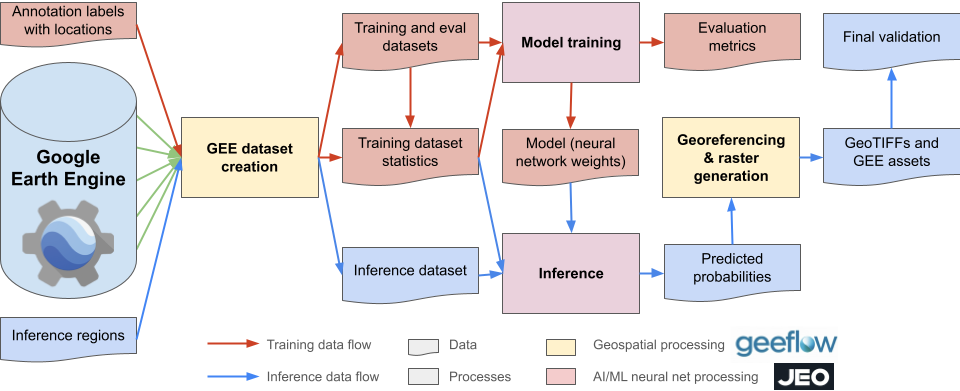

import AudioPlayer from "@site/src/components/AudioPlayer";

<AudioPlayer audioSrc={require("./audio.wav").default} />

<!-- truncate -->

import TermynalReact from "@site/src/components/Termynal";

After working hands-on with [JAX](https://github.com/google/jax)—particularly through libraries like [`fdtdx`](https://github.com/ymahlau/fdtdx) for accelerating electromagnetic simulations—I've come to see it not just as a tool for deep learning, but as a core engine for modern scientific computing. What makes JAX stand out is its elegant fusion of NumPy-like syntax, automatic differentiation, and hardware-agnostic acceleration across CPUs, GPUs, and TPUs—all wrapped in a functional programming model that encourages composability and clarity.

Beyond its foundational capabilities, high-level libraries like NNX (see example below) further extend JAX’s flexibility, making it easy to build modular, expressive, and differentiable models with minimal boilerplate. This powerful ecosystem positions JAX as a go-to framework not only for machine learning, but also for developing high-performance simulations across disciplines such as physics, electromagnetics, and scientific optimization—unlocking workflows that demand both numerical precision and differentiable programming.

```python
from flax import nnx
import optax


class Model(nnx.Module):
  def __init__(self, din, dmid, dout, rngs: nnx.Rngs):
    self.linear = nnx.Linear(din, dmid, rngs=rngs)
    self.bn = nnx.BatchNorm(dmid, rngs=rngs)
    self.dropout = nnx.Dropout(0.2, rngs=rngs)
    self.linear_out = nnx.Linear(dmid, dout, rngs=rngs)

  def __call__(self, x):
    x = nnx.relu(self.dropout(self.bn(self.linear(x))))
    return self.linear_out(x)

model = Model(2, 64, 3, rngs=nnx.Rngs(0))  # eager initialization
optimizer = nnx.Optimizer(model, optax.adam(1e-3))  # reference sharing

@nnx.jit  # automatic state management for JAX transforms
def train_step(model, optimizer, x, y):
  def loss_fn(model):
    y_pred = model(x)  # call methods directly
    return ((y_pred - y) ** 2).mean()

  loss, grads = nnx.value_and_grad(loss_fn)(model)
  optimizer.update(grads)  # in-place updates

  return loss

nnx.display(optimizer)
```


Building on these capabilities, in this post I’ll highlight some of the most exciting open-source projects built on JAX and demonstrate how they can be used in scientific computing to model complex physical systems—ranging from solving ordinary and partial differential equations (ODEs/PDEs), to simulating molecular dynamics, electromagnetic wave propagation, fluid dynamics, and geophysical processes. These tools empower researchers to explore phenomena such as heat diffusion, quantum interactions, wave mechanics, subsurface imaging, and environmental transport models with high performance and end-to-end differentiability. I’ll also discuss where these tools can be effectively applied across domains such as physics, engineering, geosciences, earth and environmental systems, and computational biology to optimize and accelerate research workflows.

To run the code examples in this post, you’ll need to install JAX. You can do this by running the following command in your terminal or in the environment where you plan to run the examples:

<TermynalReact lines ={[
{ type: 'input', value: 'pip install -U "jax[cuda12]" -q' },
]} />


:::tip
Use the following code snippet to verify that JAX is installed correctly and to determine which hardware accelerator (CPU, GPU, or TPU) is being used:
```python
import jax

# List all available devices
devices = jax.devices()
print(devices)
print(jax.default_backend())
print(jax.lib.xla_bridge.get_backend().platform)
```
:::

##  1. Differentiable ODEs with [`Diffrax`](https://github.com/patrick-kidger/diffrax)

JAX’s powerful automatic differentiation system enables seamless integration of differential equations into loss functions and optimization routines. Building on this foundation, **Diffrax** provides state-of-the-art ODE solvers that are fully compatible with `jax.grad`, enabling end-to-end differentiability. This extends JAX’s capabilities far beyond neural network training, transforming it into a versatile tool for solving both ordinary differential equations (ODEs) and partial differential equations (PDEs) within a unified, gradient-based framework.

### Applications

Diffrax can be applied across a wide range of scientific and engineering domains, including:

* **Physics-informed neural networks (PINNs)** – Solve ODEs and PDEs by incorporating physical laws directly into model training.
* **Parameter estimation and system identification** – Learn unknown parameters of dynamical systems using gradient-based optimization.
* **Optimal control and trajectory planning** – Optimize control inputs for physical systems such as robots or autonomous vehicles.
* **Biological and ecological modeling** – Fit and simulate population dynamics, gene regulation networks, or epidemiological models.
* **Financial modeling** – Solve stochastic differential equations for pricing, forecasting, or risk assessment.

The following example demonstrates how to solve a simple ODE using Diffrax:

### Example: Solve

$$
y(0)=1 \quad \frac{\mathrm{~d} y}{\mathrm{~d} t}(t)=-y(t)
$$

over the interval $[0,3]$.

<TermynalReact lines ={[
{ type: 'input', value: 'pip install -U diffrax -q' },
]} />


```python
from diffrax import diffeqsolve, Dopri5, ODETerm, SaveAt, PIDController

vector_field = lambda t, y, args: -y
term = ODETerm(vector_field)
solver = Dopri5()
saveat = SaveAt(ts=[0., 1., 2., 3.])
stepsize_controller = PIDController(rtol=1e-5, atol=1e-5)

sol = diffeqsolve(term, solver, t0=0, t1=3, dt0=0.1, y0=1, saveat=saveat,
                  stepsize_controller=stepsize_controller)

print(sol.ts)
print(sol.ys)
```


## 2. Electromagnetic Simulation with [`fdtdx`](https://github.com/ymahlau/fdtdx)


[`fdtdx`](https://github.com/ymahlau/fdtdx) is a JAX-based solver for simulating electromagnetic wave propagation using the finite-difference time-domain (FDTD) method—a widely adopted numerical approach for solving Maxwell’s equations. The library supports 1D, 2D, and 3D simulations with GPU acceleration through JAX's `jit` compilation.

What makes `fdtdx` particularly powerful is its ability to run **differentiable simulations**, enabling gradient-based optimization and control. This feature opens the door to integrating electromagnetic simulations directly into learning and optimization pipelines, dramatically accelerating scientific and engineering workflows.

### Applications

`fdtdx` can be used in a wide range of scientific and engineering domains, including:

* **Antenna design** – Automatically optimize shape, size, and placement to achieve desired radiation patterns.
* **Waveguide and photonic circuit analysis** – Simulate and refine structures for efficient light propagation.
* **Metamaterial and photonic crystal engineering** – Design custom materials with tailored electromagnetic properties.
* **Inverse design problems** – Use gradients to iteratively improve device geometry or material distribution.
* **Differentiable physics-informed ML** – Integrate Maxwell-compliant simulations into neural network training.


## 3. Molecular Simulation with [`jax-md`](https://github.com/jax-md/jax-md)

jax-md is a high-performance, differentiable molecular dynamics engine built with JAX, designed for simulating particles, materials, and custom potentials. Molecular dynamics is a key tool in computational condensed matter physics, used to explore how microscopic interactions give rise to macroscopic behavior.

### Applications

`jax-md` can be applied in various domains, including:
* **Materials science** – Simulate crystal structures, defects, and phase transitions.
* **Biophysics** – Model protein folding, ligand binding, and molecular interactions.
* **Chemistry** – Study reaction dynamics, solvent effects, and catalysis.


<iframe width="560" height="315" src="https://www.youtube.com/embed/Bkm8tGET7-w?si=mshSBt_3T4R_ha9E" title="YouTube video player" frameborder="0" allow="accelerometer; autoplay; clipboard-write; encrypted-media; gyroscope; picture-in-picture; web-share" referrerpolicy="strict-origin-when-cross-origin" allowfullscreen></iframe>


## 4. Scientific ML with [`Equinox`](https://github.com/patrick-kidger/equinox)

Equinox is a flexible JAX library designed for building models—including neural networks and physical systems—using a PyTorch-like syntax. It integrates seamlessly with JAX's functional paradigm, offering features like filtered transformation APIs, PyTree manipulation utilities, and support for runtime errors. Equinox models are pure PyTrees, enabling smooth compatibility with JAX transformations such as jit, grad, and vmap. It's a great choice for scientific computing workflows that require combining neural and physics-based models within the same differentiable pipeline

<TermynalReact lines ={[
    { type: 'input', value: 'pip install -U equinox -q' },
]} />


```python
import equinox as eqx
import jax

class Linear(eqx.Module):
    weight: jax.Array
    bias: jax.Array

    def __init__(self, in_size, out_size, key):
        wkey, bkey = jax.random.split(key)
        self.weight = jax.random.normal(wkey, (out_size, in_size))
        self.bias = jax.random.normal(bkey, (out_size,))

    def __call__(self, x):
        return self.weight @ x + self.bias

@jax.jit
@jax.grad
def loss_fn(model, x, y):
    pred_y = jax.vmap(model)(x)
    return jax.numpy.mean((y - pred_y) ** 2)

batch_size, in_size, out_size = 32, 2, 3
model = Linear(in_size, out_size, key=jax.random.PRNGKey(0))
x = jax.numpy.zeros((batch_size, in_size))
y = jax.numpy.zeros((batch_size, out_size))
grads = loss_fn(model, x, y)
```

## 5. Model training and inference for geospatial remote sensing and Earth Observation with [`Jeo`](https://github.com/google-deepmind/jeo)

Jeo is an open-source library developed by Google DeepMind for training machine learning models in geospatial remote sensing and Earth Observation (EO) applications. Built on JAX and Flax, Jeo offers a flexible and scalable framework designed to run seamlessly on CPUs, GPUs, and Google Cloud TPU VMs.
Jeo provides a comprehensive set of tools for building, training, and evaluating models on large-scale geospatial datasets. It includes support for data loading, preprocessing, model definition, training loops, and evaluation metrics—all optimized for high performance and scalability.



## Applications

Jeo is particularly well-suited for applications in Earth Observation and remote sensing, including:

* **Land cover classification** – Classify satellite imagery into different land cover types (e.g., urban, forest, water).
* **Change detection** – Identify changes in land use or land cover over time using multi-temporal satellite data.
* **Tracking and monitoring** – Monitor environmental changes such as deforestation, urbanization, or natural disasters.
    - [NeurIPS 2024 Workshop on Tackling Climate Change with Machine Learning](https://www.climatechange.ai/events/neurips2024)
* **Object detection** – Detect and classify objects in satellite imagery, such as buildings, roads, or vehicles.
    - [Planted: a dataset for planted forest identification from multi-satellite time series](https://arxiv.org/pdf/2406.18554)

## Looking Ahead

JAX is transforming scientific programming by:

* Unifying simulation, optimization, and differentiation
* Supporting GPU/TPU acceleration
* Enabling end-to-end differentiable workflows

**Coming soon**: A beginner-friendly guide on how to get started with JAX—from installation to writing your first `jit`-compiled function, understanding `grad`, and building your first differentiable simulator.

> ⚡ The future of research is fast, differentiable, and written in JAX.

## Conclusion

AX goes beyond accelerating model training and inference—it redefines what’s possible in the machine learning context by seamlessly integrating scientific computing into ML workflows. With NumPy-like syntax, automatic differentiation, and XLA-compiled execution across CPUs, GPUs, and TPUs, JAX empowers researchers to build high-performance, end-to-end differentiable systems. Its functional programming paradigm and composable transformations—such as jit, grad, vmap, and pmap—make it easy to define and express complex models, simulators, and optimization routines. Unlike traditional ML libraries focused primarily on neural networks, JAX supports a broader class of models that incorporate physics, dynamics, and numerical solvers—enabling more interpretable, grounded, and scientifically rigorous machine learning.

JAX has also played a central role in training large foundation models such as Gemma and Gemini, which were developed using JAX in combination with ML Pathways, Google’s scalable infrastructure for multitask learning. JAX’s ability to leverage modern hardware—especially TPUs—enables faster, more efficient training at massive scale. As detailed in the Gemini research paper, "the 'single controller' programming model of JAX and Pathways allows a single Python process to orchestrate the entire training run, dramatically simplifying the development workflow." This synergy between JAX and Pathways exemplifies how cutting-edge infrastructure and functional design can accelerate the creation of general-purpose AI systems.

### References

- [Diffrax Documentation](https://docs.kidger.site/diffrax/)
- [Using JAX to accelerate our research](https://deepmind.google/discover/blog/using-jax-to-accelerate-our-research/)
- [A flexible framework for large-scale FDTD simulations: open-source inverse design for 3D nanostructures](https://arxiv.org/html/2412.12360v2)
- [JAX, M.D.: A Framework for Differentiable Physics](https://arxiv.org/abs/1912.04232)
- [Equinox Documentation](https://docs.kidger.site/equinox/)
- [Jeo Documentation](https://google-deepmind.github.io/jeo/)
- [Gemma 3 model card](https://ai.google.dev/gemma/docs/core/model_card_3#:~:text=to%20operate%20sustainably.-,Software,dramatically%20simplifying%20the%20development%20workflow.%22)
- [Deep Learning with JAX](https://www.manning.com/books/deep-learning-with-jax)