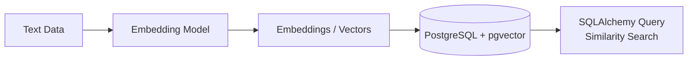
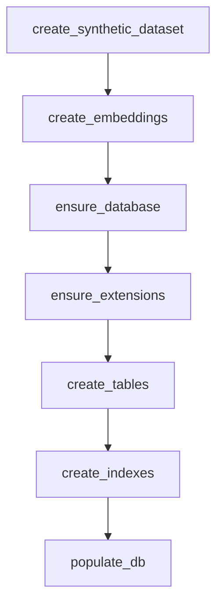
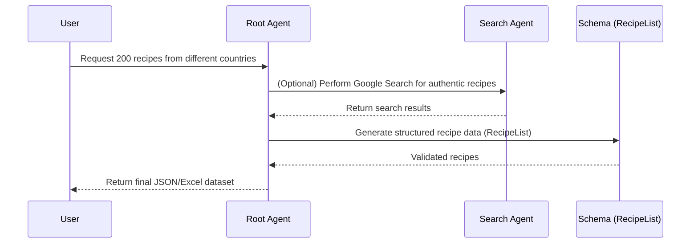

<!-- truncate -->

Embedding models are the backbone of modern search and Retrieval-Augmented Generation (RAG) systems. They offer a machine learning-based approach to encode multimodal data—such as text, code, images, and audio—into dense, high-dimensional vector representations that preserve semantic meaning. In this vector space, each data point is represented as a numerical vector, and items with similar meanings naturally cluster together. This allows systems to search, rank, and reason based on meaning, rather than relying on brittle string matches or exact keyword overlap.

This semantic representation unlocks smarter retrieval pipelines and more reliable, grounded generative answers, which are critical for building scalable and trustworthy AI applications across domains.

Embedding models power a wide range of real-world applications, including:

* **Semantic Search**: Retrieve content that matches the *intent* of a query—even if the words are different. Perfect for document search, Q\&A systems, and internal knowledge bases.
* **Retrieval-Augmented Generation (RAG)**: Fetch the most relevant context to ground large language models, improving factual accuracy and traceability in generated responses.
* **Recommendation Systems**: Recommend similar items—articles, videos, products—based on shared meaning rather than manual tagging or exact history.
* **Clustering and Topic Modeling**: Group related items together to uncover patterns, trends, and themes in large datasets (e.g., customer feedback or scientific publications).
* **Deduplication and Near-Duplicate Detection**: Identify redundant or highly similar entries that simple string comparisons would miss.
* **Cross-Lingual Retrieval**: Match content across different languages using shared multilingual vector spaces—critical for global applications.
* **Anomaly Detection**: Spot outliers based on distance from “normal” behavior in embedding space, useful in fraud detection or monitoring systems.
* **Intent Routing and Tool Selection**: Embed user queries and route them to the appropriate models, APIs, or workflows based on semantic similarity.

### Building a Recipe RAG Pipeline

In this post, we’ll put embeddings to work with a hands-on example that shows how they make RAG possible end to end. Specifically, we are building a **recipe-focused Retrieval-Augmented Generation (RAG) pipeline**, powered by a synthetic dataset generated with Gemini. Recipes provide a familiar yet structured domain that makes it easy to showcase how semantic search goes beyond traditional keyword-based approaches.

Unlike simple keyword queries, this system allows you to explore recipes by **semantic meaning**. That means you can:

* Find dishes with similar ingredients or preparation styles
* Filter by preparation time
* Search by country of origin
* Retrieve recipes that include specific ingredients

We’ll:

1. Generate a synthetic corpus with Gemini (recipe dataset).
2. Create embeddings using both Gemini and Gemma.
3. Store embeddings in PostgreSQL with pgvector.
4. Perform semantic retrieval using cosine similarity.
5. Build a retrieval-augmented generation (RAG) pipeline tailored to recipes.
6. *(Optional)* Evaluate retrieval effectiveness and visualize the embedding space interactively.

### Workflow Overview

The journey from raw text to queryable embeddings follows this pipeline:



Here, raw text is transformed into embeddings, stored in PostgreSQL with pgvector, and later retrieved through similarity search. This storage and retrieval layer grounds our RAG pipeline, ensuring that generative models work with **relevant, semantically aligned context**.

## Hands-On Tutorial

With the high-level pipeline and background covered, it’s time to move from theory into practice. We’ll begin with some boilerplate code—covering the essential imports, a few utility constants, and the schema definition.

```python
import asyncio
import functools
import logging
import os
import time
from typing import Any, AsyncGenerator, Sequence
from typing import Optional

import kagglehub
import numpy as np
import pandas as pd
import plotly.express as px
import torch
import umap.umap_ as umap
from dotenv import load_dotenv
from google import genai
from google.genai import types
from google.genai.types import SingleEmbedContentResponse, InlinedEmbedContentResponse
from pgvector.sqlalchemy import Vector
from pydantic import BaseModel
from pydantic_settings import BaseSettings
from sentence_transformers import SentenceTransformer
from sklearn.decomposition import PCA
from sklearn.manifold import TSNE
from sqlalchemy import Column, Integer, String, insert, select, Row
from sqlalchemy import URL
from sqlalchemy.ext.asyncio import AsyncSession, create_async_engine, async_sessionmaker
from sqlalchemy.orm import DeclarativeBase
from sqlalchemy.orm import registry
from sqlalchemy.sql import text


# Set up logging
logger = logging.getLogger(__name__)
logging.basicConfig(level=logging.INFO)
# Disable parallelism in tokenizers to avoid warnings
os.environ["TOKENIZERS_PARALLELISM"] = "False"
# Load environment variables from a .env file
load_dotenv(dotenv_path="dev.env")

class Recipe(BaseModel):
    recipe_name: str
    description: str
    ingredients: list[str]
    time_minutes: int
    country: str

# Define constants and initialize the GenAI client
client = genai.Client()
EMBED_DIM=768
SYNTHETIC_DATASET_FILE = "./recipes.csv"
EMBEDDING_DATASET_FILE = "./recipes_with_embeddings.parquet"
MODEL_NAME = "gemini-2.5-pro"
GEMMA_EMBEDDING_MODEL = "google/embeddinggemma/transformers/embeddinggemma-300m"
GEMINI_EMBEDDING_MODEL = "gemini-embedding-001"

def timeit(func):
  """A decorator to measure the execution time of an async function."""
  if not asyncio.iscoroutinefunction(func):
    raise TypeError("timeit decorator can only be used with async functions")

  @functools.wraps(func)
  async def wrapper(*args, **kwargs):
    start = time.perf_counter()
    result = await func(*args, **kwargs)
    end = time.perf_counter()
    logger.info(f"{func.__name__} took {end - start:.4f} seconds")
    return result

  return wrapper

# Utility function to parse fields content as and string
def _as_str(x) -> str:
  """Robustly stringifies an object, handling lists, tuples, sets, and None."""
  if x is None:
    return ""
  if isinstance(x, (list, tuple, set)):
    return ", ".join(map(str, x))
  return str(x)

```

Once the groundwork is set, we can move on to the setup pipeline itself—starting with data generation, continuing with embedding creation, and finishing with database setup for storage and retrieval.

#### Pipeline Overview



**Pipeline function**

```python
async def setup() -> None:
    """Runs the full data pipeline: create dataset, embeddings, and set up the database."""
    create_synthetic_dataset(n=200)
    create_embeddings()
    await ensure_database()
    await ensure_extensions()
    await create_tables()
    await create_indexes()
    await populate_db()
```
In the previous code the `setup()` function orchestrates the entire pipeline, from generating data to populating the database. Here’s what happens at each step:

* **`create_synthetic_dataset(n=200)`**
  Generates a synthetic dataset of 200 examples that we will use throughout the pipeline. This provides the raw text data needed to build embeddings.

* **`create_embeddings()`**
  Transforms the dataset into vector representations (embeddings) using our embedding model. These embeddings capture semantic meaning and will later be stored in the database.

* **`await ensure_database()`**
  Verifies that the PostgreSQL database exists and is accessible. If not, it creates the database to ensure the rest of the pipeline can run smoothly.

* **`await ensure_extensions()`**
  This step ensures that the pgvector extension is installed and enabled in our PostgreSQL instance. The pgvector extension adds support for vector datatypes, which are not natively available in PostgreSQL. Without it, we wouldn’t be able to store or query embeddings efficiently.

  **Specifically, pgvector provides:**

    * A dedicated vector column type for storing embeddings as arrays of floats.
    * Built-in functions for computing similarity and distance metrics, such as cosine similarity, Euclidean distance, and inner product.
    * Support for indexing methods (e.g., IVF, HNSW) that accelerate similarity searches across large embedding collections.

* **`await create_tables()`**
  Creates the necessary tables in the database using SQLAlchemy models. This step defines the schema for storing both metadata and embeddings.

* **`await create_indexes()`**
  Adds vector indexes (such as IVF or HNSW, depending on the configuration) to speed up similarity search queries against the stored embeddings.

* **`await populate_db()`**
  Inserts the dataset and its embeddings into the database, making them available for retrieval and search operations.


## 1. Generate a Synthetic Recipe Dataset

This is the first step in our pipeline: we’ll start by generating a synthetic corpus to work with. Instead of manually collecting recipes, we’ll leverage Gemini’s reasoning capabilities along with the API’s support for structured outputs to automatically produce a DataFrame containing 200 unique recipes from around the world. This dataset will then be exported to a CSV file, which we’ll use later when computing embeddings.

```python
def create_synthetic_dataset(n: int = 100) -> None:
  """Uses Gemini to create a synthetic dataset of recipes and saves it as a CSV file.

  Args:
      n: The number of unique recipes to generate.
  """

  prompt_for_synthetic_data = f"""
    Generate a list of unique recipes from around the world:
    
    Requirements:
    - Exactly {n} UNIQUE recipes.
    - Each recipe must include: recipe_name, description, ingredients (array of strings), time_minutes (int), country (string), preparation (string).
    - Use a variety of countries/regions. Avoid duplicates by recipe_name.
    """
  response = client.models.generate_content(
    model=MODEL_NAME,
    contents=types.Part.from_text(text=prompt_for_synthetic_data),
    config= types.GenerateContentConfig(
      response_mime_type="application/json",
      response_schema=list[Recipe],
      thinking_config = types.ThinkingConfig(
        include_thoughts=True
      )
    )
  )
  
  structured_output = response.parsed
  df = pd.DataFrame([item.model_dump() for item in structured_output])
  df.to_csv(SYNTHETIC_DATASET_FILE, index=False)
  logger.info(f"Synthetic dataset created and saved to {SYNTHETIC_DATASET_FILE}  with {len(df)} records.")
```

## 2. Compute Gemini and Gemma embeddings


Next, we enrich our synthetic dataset by adding two new columns: one with Gemini embeddings and another with Gemma embeddings. To do this, we’ll take the recipe descriptions—along with a few other key fields—and turn them into vector representations using the embedding models. Think of embeddings like placing each recipe as a point on a map, where similar recipes end up closer together. These “map coordinates” are what will power our RAG (Retrieval-Augmented Generation) semantic search system, helping it find and connect information by meaning, not just keywords.

Although Gemma Embeddings were designed as a lighter alternative—optimized for on-device AI—they draw significant inspiration from the Gemini architecture in their implementation. To just mention a case, Both models share a common foundation, having been trained with Matryoshka Representation Learning (MRL), a technique that makes embeddings more flexible and efficient. Out of curiosity (and not as a strict benchmark), we’ll compare Gemini’s embeddings side by side with Gemma’s open-weights version. To keep the comparison fair, we configured the `gemini-embedding-001` model to produce vectors with a dimensionality of 768.

here is the code:

```python
def create_embeddings(limit: Optional[int] = None) -> None:
    """Reads the synthetic dataset, generates embeddings, and saves the result to a Parquet file.

    This function reads the `recipes.csv` file, constructs a unified text field for each
    recipe, and then generates embeddings using both Gemini and Gemma models. The resulting
    DataFrame, including the new embedding columns, is saved to a Parquet file.

    Args:
        limit: An optional integer to limit the number of rows processed from the
               input CSV. Useful for testing.
    """

    df = pd.read_csv(SYNTHETIC_DATASET_FILE)
    if limit:
        df = df.head(limit).copy()

    # Build the unified text field
    df["text"] = df.apply(
        lambda row: (
            f"Recipe: {_as_str(row.get('recipe_name'))}.\n"
            f"Description: {_as_str(row.get('description'))}.\n"
            f"Ingredients: {_as_str(row.get('ingredients'))}.\n"
            f"Country: {_as_str(row.get('country'))}.\n"
            f"Time to prepare: {_as_str(row.get('time_minutes'))} minutes."
        ),
        axis=1
    )

    texts = df["text"].tolist()
    # Compute embeddings only if missing
    if "gemini_embedding" not in df.columns or df["gemini_embedding"].isna().any():
        df["gemini_embedding"] = get_gemini_embeddings(texts)
    if "gemma_embedding" not in df.columns or df["gemma_embedding"].isna().any():
        df["gemma_embedding"] = get_gemma_embeddings(texts)

    df.to_parquet(EMBEDDING_DATASET_FILE, index=False, engine="pyarrow")
    logger.info(f"Embeddings created and saved to {EMBEDDING_DATASET_FILE} with {len(df)} records.")
```

### Compute embeddings with Gemini

The **Gemini API** provides text embedding models capable of generating embeddings for words, phrases, sentences, and even code. These embeddings serve as a foundation for advanced NLP tasks such as semantic search, classification, and clustering, delivering more accurate and context-aware results than traditional keyword-based methods.

You can apply embeddings across a wide range of tasks, including **semantic similarity**, **classification**, and **clustering**. For the complete list of supported task types, see the [Supported task types table](https://ai.google.dev/gemini-api/docs/embeddings#supported-task-types). Choosing the appropriate task type helps optimize the embeddings for your specific use case, improving both accuracy and efficiency.

You can adjust the size of the embedding vector with the `output_dimensionality` parameter. Smaller dimensions reduce storage requirements and speed up downstream computations, while typically sacrificing little in quality. By default, embeddings are **3072-dimensional**, but recommended options include **768**, **1536**, or **3072**.

* The **3072-dimensional** embeddings are normalized by default, making them ideal for semantic similarity tasks since they rely on comparing vector directions rather than magnitudes.
* For other dimensions (e.g., 768 or 1536), you’ll need to apply normalization yourself before using them for similarity comparisons.

:::info
The Gemini embedding model, `gemini-embedding-001`, is trained using [Matryoshka Representation Learning (MRL)](https://arxiv.org/abs/2205.13147). This method enables the model to produce high-dimensional vectors where the initial components/dimensions (the prefixes) capture the most important information. As a result, we can truncate the original large embedding—typically to 512 or 768 dimensions—while still preserving most of its semantic content. This approach makes embeddings more flexible: it provides full detail when necessary and lighter, faster representations for efficiency. For more details check: [Introduction to Matryoshka Embedding Models](https://huggingface.co/blog/matryoshka#why-would-you-use-%F0%9F%AA%86-matryoshka-embedding-models)

:::

```python
def get_gemini_embeddings(texts: list[str]) -> list[list[float]]:
    """Computes embeddings for a list of texts using the Gemini Embedding model in batch mode.

    This function sends a batch embedding request to the Gemini API. It's suitable for
    processing a large number of documents at once, which is more efficient than sending
    one request per document. The function will poll the API until the batch job is
    completed and then return the resulting embeddings.

    Args:
        texts: A list of strings to embed.

    Returns:
        A list of embeddings, where each embedding is a list of floats.

    Raises:
        RuntimeError: If the batch embedding job fails.
    """
    # Create a batch embedding job request. This sends all texts to the API at once.
    batch_job = client.batches.create_embeddings(
        # Specify the model to use for generating embeddings.
        model=GEMINI_EMBEDDING_MODEL,
        # Define the source of the texts to be embedded. Here, we use an in-memory list.
        src=types.EmbeddingsBatchJobSource(
            # `inlined_requests` is used for providing the data directly in the request.
            inlined_requests=types.EmbedContentBatch(
                # Convert each text string into a `Part` object for the API.
                contents=[types.Part.from_text(text=text) for text in texts],
                # Configure the embedding task.
                config=types.EmbedContentConfig(
                    # `RETRIEVAL_DOCUMENT` is optimized for texts that will be stored and retrieved.
                    task_type="RETRIEVAL_DOCUMENT",
                    # Specify the desired dimension for the output embedding vectors.
                    output_dimensionality=EMBED_DIM
                )
            )
        ),
        # Configure the batch job itself, giving it a display name for identification.
        config=types.CreateEmbeddingsBatchJobConfig(
            display_name="embedding-batch-job"
        )
    )
    # Log the name of the created batch job for tracking.
    logging.info(f"Created batch job: {batch_job.name}")
    # Define the set of states that indicate the job has finished.
    completed_states = {'JOB_STATE_SUCCEEDED', 'JOB_STATE_FAILED', 'JOB_STATE_CANCELLED', 'JOB_STATE_EXPIRED'}

    # Get the unique name of the job to use for polling.
    job_name = batch_job.name
    logger.info(f"Polling status for job: {job_name}")
    # Fetch the initial status of the batch job.
    batch_job = client.batches.get(name=job_name)  # Initial get
    # Loop and poll the job status until it reaches a completed state.
    while batch_job.state.name not in completed_states:
        logger.info(f"Current state: {batch_job.state.name}")
        # Wait for 30 seconds before checking the status again to avoid excessive polling.
        time.sleep(30)  # Wait for 30 seconds before polling again
        batch_job = client.batches.get(name=job_name)

    logger.info(f"Job finished with state: {batch_job.state.name}")
    # If the job failed, raise an error with the details.
    if batch_job.state.name == 'JOB_STATE_FAILED':
        raise RuntimeError(f"Batch job failed: {batch_job.error}")

    # Initialize an empty list to store the final embeddings.
    embeddings = []
    # Check if the job destination contains the inlined responses.
    if batch_job.dest and batch_job.dest.inlined_embed_content_responses:
        # Iterate through each response in the completed batch job.
        for content_response in batch_job.dest.inlined_embed_content_responses:
            content_response: InlinedEmbedContentResponse
            # If a specific text failed to embed, log the error and append an empty list.
            if content_response.error:
                logging.error(f"Error in content response: {content_response.error}")
                embeddings.append([])
                continue
            # Extract the successful embedding response.
            embed_response: SingleEmbedContentResponse = content_response.response
            # Append the embedding values (a list of floats) to our results.
            embeddings.append(embed_response.embedding.values)
    return embeddings
```

### Compute embeddings with Gemma


**EmbeddingGemma** is a 308M-parameter multilingual text embedding model built on Gemma 3. It is designed to run efficiently on consumer hardware such as phones, laptops, and tablets, while still delivering strong performance on a wide range of language tasks.

At its core, the model produces **numerical representations of text** that can be applied to downstream tasks including information retrieval, semantic similarity search, classification, and clustering.

#### Key Features

* **Multilingual support**: Trained on over 100 languages to provide broad linguistic coverage.
* **Flexible output dimensions**: Supports dimensionality from 768 down to 128 using Matryoshka Representation Learning (MRL), enabling a tradeoff between speed, storage, and accuracy.
* **2K token context window**: Handles long text inputs and documents directly on-device.
* **Storage efficiency**: Runs in under 200MB of RAM when quantized, making it suitable for resource-constrained environments.
* **Low latency**: Generates embeddings in less than 22ms on EdgeTPU, enabling fast and responsive applications.
* **Offline and secure**: Operates without an internet connection, ensuring sensitive data remains private on the device.

EmbeddingGemma brings high-quality, multilingual text understanding directly to personal hardware. This makes it possible to build applications that are not only fast and efficient but also secure and reliable—without requiring constant cloud connectivity.

For more information, check the official documentation @ [EmbeddingGemma model overview](https://ai.google.dev/gemma/docs/embeddinggemma)

In the following function, we use the Sentence-Transformers library, which offers a high-level API for working with embedding models:

```python
def get_gemma_embeddings(texts: list[str]) -> list[list[float]]:
  """Computes embeddings for a list of texts using a local Gemma model.
  
  This function uses the `sentence-transformers` library to load a pre-trained
  Gemma embedding model from Kaggle Hub. It automatically uses a CUDA-enabled GPU
  if available, otherwise, it falls back to the CPU. It then encodes the provided
  list of texts into embedding vectors.
  
  Args:
      texts: A list of strings to embed.
  
  Returns:
      A list of embeddings, where each embedding is a list of floats.
  """
  # Determine the computation device: 'cuda' for GPU if available, otherwise 'cpu'.
  device = "cuda" if torch.cuda.is_available() else "cpu"
  # Download the Gemma model from Kaggle Hub and get the local path.
  model_id = kagglehub.model_download(GEMMA_EMBEDDING_MODEL)
  # Load the pre-trained SentenceTransformer model and move it to the selected device.
  model = SentenceTransformer(model_id).to(device=device)
  # Encode the list of texts into embedding vectors.
  candidate_embeddings = model.encode(texts)
  # Convert the resulting numpy array of embeddings to a standard Python list of lists.
  return candidate_embeddings.tolist()
```

## 3. Implement vector store with PostgreSQL and pgvector

To proceed with the implementation of our **RAG (Retrieval-Augmented Generation) system**, we need a reliable way to make embeddings useful in practice. Storing them as raw arrays in memory works for quick experiments, but quickly breaks down when scaling to thousands or millions of vectors.

This is where **pgvector** comes in—a PostgreSQL extension that enables efficient vector similarity search. With pgvector, we can store embeddings directly inside a relational database and query them using familiar SQL syntax. This makes it possible to combine **semantic search** with **structured relational data**, opening the door to richer applications.

#### Why pgvector + SQLAlchemy?

In this section, we’ll set up a vector store with pgvector and connect it to our application. To simplify database interactions, we’ll use SQLAlchemy, which provides a clean Pythonic interface for working with PostgreSQL. With SQLAlchemy, we can define schemas as Python classes, manage migrations, and write maintainable queries—all while seamlessly integrating pgvector’s custom vector column types.

By combining pgvector with SQLAlchemy, we get the best of both worlds: efficient vector similarity search within PostgreSQL, and a scalable, developer-friendly abstraction layer that makes the pipeline easier to build, extend, and maintain in production.

**Database and SQLAlchemy setup**

```python
class DbSettings(BaseSettings):
    DB_HOST: str = "localhost"
    DB_PORT: int = 5432
    DB_NAME: str = "recipesdb"
    DB_USER: str = "<postgres user>"
    DB_PASSWORD: str = "<postgres user password>"

settings = DbSettings()


db_url = URL.create(
    drivername="postgresql+asyncpg",
    username=settings.DB_USER,
    password=settings.DB_PASSWORD,  # URL.create safely quotes special chars
    host=settings.DB_HOST,
    port=settings.DB_PORT,
    database=settings.DB_NAME,
)

engine = create_async_engine(db_url, pool_pre_ping=True)
SessionLocal = async_sessionmaker(engine, expire_on_commit=False, class_=AsyncSession)
mapper_registry = registry()


class Base(DeclarativeBase):
    registry = mapper_registry


class RecipeORM(Base):
    __tablename__ = "recipes"

    id = Column(Integer, primary_key=True, autoincrement=True)
    recipe_name = Column(String, index=True)
    description = Column(String)
    ingredients = Column(String)  # Store as a comma-separated string
    preparation = Column(String)
    time_minutes = Column(Integer)
    country = Column(String)
    gemini_embedding = Column(Vector(EMBED_DIM))
    gemma_embedding = Column(Vector(EMBED_DIM))


async def get_session() -> AsyncGenerator[AsyncSession | Any, Any]:
    async with SessionLocal() as session:
        yield session

async def ensure_database():
    """Creates the target database if it doesn't exist by connecting via the 'postgres' DB."""
    # connect to the admin DB to create the target DB
    admin_url = db_url.set(database="postgres")
    admin_engine = create_async_engine(admin_url, isolation_level="AUTOCOMMIT", pool_pre_ping=True)
    try:
        async with admin_engine.begin() as conn:
            exists = await conn.scalar(
                text("SELECT 1 FROM pg_database WHERE datname = :name"),
                {"name": settings.DB_NAME},
            )
            if not exists:
                await conn.execute(text(f'CREATE DATABASE "{settings.DB_NAME}"'))
                logger.info(f'Created database "{settings.DB_NAME}".')
    finally:
        await admin_engine.dispose()

async def ensure_extensions():
    """Installs required PostgreSQL extensions (e.g., 'vector') in the target database."""
    async with engine.begin() as conn:
        # Install pgvector extension; requires superuser or appropriate privs
        await conn.execute(text("CREATE EXTENSION IF NOT EXISTS vector"))
        logger.info("Ensured extension: vector")

async def create_tables():
    """Drops and recreates the database tables based on the SQLAlchemy ORM models."""
    async with engine.begin() as conn:
        await conn.run_sync(mapper_registry.metadata.drop_all)
        await conn.run_sync(mapper_registry.metadata.create_all)


def chunked(iterable: list, n: int) -> list:
    """Yields successive n-sized chunks from a list."""
    for i in range(0, len(iterable), n):
        yield iterable[i:i+n]

async def populate_db(chunk_size: int = 2000):
    """Populates the database with recipes and their embeddings from the Parquet file.

    Args:
        chunk_size: The number of rows to insert in each bulk operation.
    """
    df = pd.read_parquet(EMBEDDING_DATASET_FILE, engine="pyarrow")

    # Build payload rows
    rows = []
    for _, r in df.iterrows():
        rows.append({
            "recipe_name":      r.get("recipe_name"),
            "description":      r.get("description"),
            "ingredients":      ",".join(r.get("ingredients").strip("[]").replace("'", "").split(",")),
            "time_minutes":     r.get("time_minutes"),
            "preparation":      r.get("preparation"),
            "country":          r.get("country"),
            "gemini_embedding": r.get("gemini_embedding"),  # list[float] — pgvector will handle it
            "gemma_embedding":  r.get("gemma_embedding"),   # list[float] — pgvector will handle it
        })
    # Fast bulk insert in chunks
    async with SessionLocal() as session:
        stmt = insert(RecipeORM)
        for chunk in chunked(rows, chunk_size):
            async with session.begin():
                await session.execute(stmt, chunk)


async def create_indexes():
  """Creates IVFFlat indexes on the embedding columns for faster similarity searches."""
  async with engine.begin() as conn:
    await conn.execute(text("CREATE INDEX IF NOT EXISTS idx_gemini_embedding_cosine ON recipes USING ivfflat (gemini_embedding vector_cosine_ops) WITH (lists = 100)"))
    await conn.execute(text("CREATE INDEX IF NOT EXISTS idx_gemma_embedding_cosine ON recipes USING ivfflat (gemma_embedding vector_cosine_ops) WITH (lists = 100)"))
    logger.info("Created indexes on embeddings.")
```

## 4. Query the RAG System

At this point, our embeddings are stored in PostgreSQL with pgvector, and we’re ready to query the system. This is where retrieval comes into play: instead of searching by keywords, we transform a user query into an embedding and perform a similarity search against our stored recipe vectors. The result is a set of semantically relevant matches, even if the exact keywords don’t appear in the text.

For example:

* A query like *“quick Mexican dishes under 20 minutes”* might return tacos, quesadillas, or salsas—even if the word *“quick”* is not explicitly mentioned in the recipe title.
* A query for *“soups with root vegetables”* would surface carrot, potato, or cassava-based soups, even when the exact phrase *“root vegetables”* is missing.

**Querying with Gemma and Gemini**

We define two query functions: one that uses Gemma embeddings and one that uses Gemini embeddings. Both follow the same high-level steps:

1. Encode the user query into an embedding.
2. Normalize the embedding for cosine similarity (For Gemini only)
3. Run a SQLAlchemy query that leverages pgvector’s cosine_distance function.
4. Filter results by similarity threshold.
5. Return the top matches, ordered by distance.

**Gemma-based query:**

```python

@timeit
async def query_gemma(query: str, limit: int = 5, similarity_threshold: float = 0.7) -> Sequence[
    Row[tuple[RecipeORM, Any]]]:
    """Queries the database for recipes similar to the input query using Gemma embeddings.

    Args:
        query: The search query string.
        limit: The maximum number of results to return.
        similarity_threshold: The maximum cosine distance for a result to be included.
                              A lower value means higher similarity.

    Returns:
        A list of tuples, where each tuple contains a RecipeORM object and its distance.
    """
    model_id = kagglehub.model_download(GEMMA_EMBEDDING_MODEL)
    device = "cuda" if torch.cuda.is_available() else "cpu"
    model = SentenceTransformer(model_id).to(device=device)

    async with SessionLocal() as session:
        query_embedding = model.encode(
            query,
            prompt_name="Retrieval-query"
        )
        select_expr = RecipeORM.gemma_embedding.cosine_distance(query_embedding).label("distance")
        stmt = (
            select(RecipeORM, select_expr)
            .where(select_expr < similarity_threshold)  # keep only close neighbors
            .order_by(select_expr.asc())                # smallest distance = most similar
            .limit(limit)
        )

        result = await session.execute(stmt)
        rows = result.all()  # list[tuple[RecipeORM, float]]

        # Example: print or return structured data
        for recipe, dist in rows:
            logger.info(f"Recipe: {recipe.recipe_name}, Country: {recipe.country}, Time: {recipe.time_minutes} mins, Distance: {dist:.4f}")

        return rows
```

**Gemini-based query:**

```python
@timeit
async def query_gemini(query: str, limit: int = 5, similarity_threshold: float = 0.7) -> Sequence[
    Row[tuple[RecipeORM, Any]]]:
    """Queries the database for recipes similar to the input query using Gemini embeddings.

    Args:
        query: The search query string.
        limit: The maximum number of results to return.
        similarity_threshold: The maximum cosine distance for a result to be included.
                              A lower value means higher similarity.

    Returns:
        A list of tuples, where each tuple contains a RecipeORM object and its distance.
    """
    result = client.models.embed_content(
        model=GEMINI_EMBEDDING_MODEL,
        contents=[types.Part.from_text(text=query)],
        config=types.EmbedContentConfig(
            task_type="RETRIEVAL_QUERY",
            output_dimensionality=EMBED_DIM
        )
    )
    async with SessionLocal() as session:
        query_embedding = np.array(result.embeddings[0].values)
        normed_embedding = query_embedding / np.linalg.norm(query_embedding)
        logger.debug(f"Normed embedding length: {len(normed_embedding)}")
        logger.debug(f"Norm of normed embedding: {np.linalg.norm(normed_embedding):.6f}")  # Should be very close to 1
        select_expr = RecipeORM.gemini_embedding.cosine_distance(normed_embedding).label("distance")
        stmt = (
            select(RecipeORM, select_expr)
            .where(select_expr < similarity_threshold)  # keep only close neighbors
            .order_by(select_expr.asc())  # smallest distance = most similar
            .limit(limit)
        )

        result = await session.execute(stmt)
        rows = result.all()  # list[tuple[RecipeORM, float]]
        # Example: print or return structured data
        for recipe, dist in rows:
            logger.info(
                f"Recipe: {recipe.recipe_name}, Country: {recipe.country}, Time: {recipe.time_minutes} mins, Distance: {dist:.4f}")

        return rows
```

Both functions return a list of matching recipes along with their similarity scores. For each recipe, we log details such as:

* Recipe name
* Country of origin
* Preparation time
* Cosine distance (similarity)

**Running a RAG Query**

Finally, we define a helper function that lets us test queries against both embeddings side by side:

```python
async def test_rag(query: str, limit: int = 5, similarity_threshold: float = 0.7) -> None:
    """Runs a RAG query against both Gemma and Gemini embeddings and prints the results.

    Args:
        query: The search query string.
        limit: The maximum number of results to return.
        similarity_threshold: The cosine distance threshold for filtering results.
    """
    await query_gemma(query, limit, similarity_threshold)
    await query_gemini(query, limit, similarity_threshold)
```

With this function, we can run a semantic query like:

```python
await test_rag("Find quick South America dishes with corn", limit=5)
```

Instead of relying on keyword matches, the system will return recipes that mean the same thing—like tacos, esquites, or tamales—even if “quick” or “corn” aren’t explicitly mentioned in the title.

**Example Output**

Here’s what the log output might look like when running the query above:

```terminaloutput
INFO:__main__:Recipe: Arepas, Country: Venezuela, Time: 35 mins, Distance: 0.4425
INFO:__main__:Recipe: Empanadas, Country: Argentina, Time: 75 mins, Distance: 0.5312
INFO:__main__:Recipe: Cachupa, Country: Cape Verde, Time: 240 mins, Distance: 0.5497
INFO:__main__:Recipe: Causa Rellena, Country: Peru, Time: 60 mins, Distance: 0.5565
INFO:__main__:Recipe: Asado, Country: Argentina, Time: 180 mins, Distance: 0.5635
INFO:__main__:query_gemma took 4.7631 seconds

INFO:__main__:Recipe: Arepas, Country: Venezuela, Time: 35 mins, Distance: 0.2650
INFO:__main__:Recipe: Cachupa, Country: Cape Verde, Time: 240 mins, Distance: 0.3252
INFO:__main__:Recipe: Ceviche, Country: Peru, Time: 25 mins, Distance: 0.3319
INFO:__main__:Recipe: Ugali, Country: Kenya, Time: 15 mins, Distance: 0.3347
INFO:__main__:Recipe: Salteñas, Country: Bolivia, Time: 240 mins, Distance: 0.3348
INFO:__main__:query_gemini took 0.2211 seconds
```

**Why This Matters**

This retrieval layer is what makes our RAG system powerful. By grounding generation in semantically aligned recipes, we move well beyond keyword search and enable more flexible, accurate, and meaningful results.


## 5. Visualizing Recipe Embeddings

Once we’ve built our RAG system and can query it effectively, the next natural step is to **visualize the embedding space**. Visualizations help us understand how recipes are clustered by similarity and whether our embeddings capture meaningful relationships between data points.

To do this, we define a function `plot_embeddings` that projects high-dimensional embeddings into **two dimensions** and generates an **interactive scatter plot** with Plotly. Each point represents a recipe, colored by country of origin, with recipe names displayed as labels.

### Dimensionality Reduction

Embeddings typically have hundreds of dimensions, which are impossible to visualize directly. To make them interpretable, we reduce them into 2D using one of three methods:

* **PCA** – a linear projection, fast and simple.
* **t-SNE** – non-linear, great for local structure, works well on smaller datasets.
* **UMAP (better suited for larger datasets)** – UMAP balances local and global structure, making it suitable for both small and large datasets

You can choose which method to apply by passing `"pca"`, `"tsne"`, or `"umap"` to the function.

```python
async def plot_embeddings( # type: ignore
        method: str = "tsne",
        save_html_path: Optional[str] = "embeddings_plot.html",
        random_state: int = 42,
        perplexity: Optional[int] = None,
        umap_neighbors: int = 15,
        umap_min_dist: float = 0.1,
):
  """Creates an interactive 2D projection of recipe embeddings.

  This function fetches embeddings from the database, reduces their dimensionality
  using a specified method (PCA, t-SNE, or UMAP), and generates an interactive
  scatter plot with Plotly, colored by country.

  Args:
      method: The dimensionality reduction technique ('pca', 'tsne', or 'umap').
      save_html_path: Path to save the interactive HTML plot. If None, not saved.
      random_state: Seed for reproducibility in t-SNE and UMAP.
      perplexity: The perplexity for t-SNE. Auto-calculated if None.
      umap_neighbors: The number of neighbors for UMAP.
      umap_min_dist: The minimum distance for UMAP.
  """
  ...
```

<details>

<summary>Show Code</summary>

```python
async def plot_embeddings( # type: ignore
    method: str = "tsne",
    save_html_path: Optional[str] = "embeddings_plot.html",
    random_state: int = 42,
    perplexity: Optional[int] = None,
    umap_neighbors: int = 15,
    umap_min_dist: float = 0.1,
):
    """Creates an interactive 2D projection of recipe embeddings.

    This function fetches embeddings from the database, reduces their dimensionality
    using a specified method (PCA, t-SNE, or UMAP), and generates an interactive
    scatter plot with Plotly, colored by country.

    Args:
        method: The dimensionality reduction technique ('pca', 'tsne', or 'umap').
        save_html_path: Path to save the interactive HTML plot. If None, not saved.
        random_state: Seed for reproducibility in t-SNE and UMAP.
        perplexity: The perplexity for t-SNE. Auto-calculated if None.
        umap_neighbors: The number of neighbors for UMAP.
        umap_min_dist: The minimum distance for UMAP.
    """
    method = method.lower()
    if method not in {"pca", "tsne", "umap"}:
        raise ValueError("method must be 'pca', 'tsne', or 'umap'")

    async with SessionLocal() as session:
        query = select(
            RecipeORM.gemini_embedding,  # Vector (list/array)
            RecipeORM.country,          # Categorical label
            RecipeORM.recipe_name       # For hover text
        )
        result = await session.execute(query)
        rows = result.all()

    if not rows:
        raise RuntimeError("No rows found.")

    # Convert to arrays/lists
    X = np.array([np.array(r[0], dtype=np.float32) for r in rows])
    countries = [r[1] for r in rows]
    names = [r[2] for r in rows]


    # Pick reducer
    if method == "pca":
        reducer = PCA(n_components=2, random_state=random_state)
        projections = reducer.fit_transform(X)
        subtitle = "PCA (linear)"
    elif method == "tsne":
        # Sensible perplexity defaults: must be < n_samples
        n = len(X)
        auto_perp = max(5, min(30, (n - 1) // 3))
        perp = perplexity if perplexity is not None else auto_perp
        perp = min(perp, max(5, n // 3 if n >= 6 else 5))
        reducer = TSNE(
            n_components=2,
            perplexity=perp,
            learning_rate="auto",
            init="pca",
            random_state=random_state,
            n_iter_without_progress=300,
            metric="cosine"
        )
        projections = reducer.fit_transform(X)
        subtitle = f"t-SNE (perplexity={perp}, cosine metric)"
    else:
        reducer = umap.UMAP(
            n_components=2,
            n_neighbors=umap_neighbors,
            min_dist=umap_min_dist,
            metric="cosine",
            random_state=random_state,
        )
        projections = reducer.fit_transform(X)
        subtitle = f"UMAP (n_neighbors={umap_neighbors}, min_dist={umap_min_dist}, cosine metric)"

    # Build interactive figure
    df = {
        "x": projections[:, 0],
        "y": projections[:, 1],
        "country": countries,
        "name": names,
        # Nice, readable hover text
        "label": [f"<b>{nm}</b><br>Country: {cty}" for nm, cty in zip(names, countries)],
    }

    fig = px.scatter(
        df,
        x="x",
        y="y",
        color="country",
        hover_name="name",
        text="name",  # 👈 this keeps the recipe name always visible
        labels={"x": "Component 1", "y": "Component 2"},
        title=f"Recipe Embeddings — {subtitle}",
        opacity=0.85
    )

    # Adjust text appearance
    fig.update_traces(
        textposition="top center",  # 'top center', 'bottom right', etc.
        marker=dict(size=8, line=dict(width=0.5)),
        hovertemplate="%{customdata[0]}<extra></extra>",
        customdata=np.array([[lbl] for lbl in df["label"]]),
    )


    # Subtle layout polish
    fig.update_layout(
        legend_title_text="Country",
        template="plotly_white",
        margin=dict(l=40, r=40, t=60, b=40),
        xaxis=dict(showgrid=True, zeroline=False),
        yaxis=dict(showgrid=True, zeroline=False),
    )

    # Optional: save sharable HTML
    if save_html_path:
        fig.write_html(save_html_path, include_plotlyjs="cdn")

    return fig
```

</details>

### Interactive Plot

The function pulls embeddings, recipe names, and countries from the database, applies the chosen dimensionality reduction, and builds an interactive Plotly scatter plot.

* **Color**: Recipes are colored by country.
* **Hover text**: Displays the recipe name and country.
* **Labels**: Recipe names are shown directly on the plot for easy exploration.

The result is an HTML file you can open in your browser and explore. For example, clusters of recipes from the same country often appear close together, while recipes with similar ingredients may form cross-country overlaps.

```python
fig = px.scatter(
    df,
    x="x",
    y="y",
    color="country",
    hover_name="name",
    text="name",
    title=f"Recipe Embeddings — {subtitle}",
    opacity=0.85
)
```

Visualizing embeddings gives us intuition about how well the model organizes recipes. If Mexican soups cluster together, or Italian pasta dishes appear in the same region of the plot, it’s a sign that the embeddings are capturing meaningful semantic structure.
By exploring these visualizations, we can validate whether our embeddings align with human intuition—and gain confidence in using them to power retrieval in our RAG pipeline.


## Bonus: Automating Synthetic Data Generation with a Multi-Agent Architecture

So far, we’ve generated recipes directly through prompts. As a bonus, let’s take it one step further and see how a **multi-agent system** can automate this process. Using **Google ADK**, we can orchestrate multiple agents that collaborate to create diverse, structured recipes—ready to use in our RAG pipeline.

### The Idea

* A **Root Agent** acts as the “head chef,” coordinating recipe generation.
* A **Search Agent** supports the Root Agent by performing Google searches when extra context is needed.
* Recipes are returned in a **structured format** defined by a Pydantic schema, ensuring clean, machine-readable outputs.

### Workflow Overview

Here’s how the agents interact to generate recipes automatically:



### Core Components

1. **Structure Outputs**
   Recipes are modeled with Pydantic, including fields like `recipe_name`, `description`, `ingredients`, `preparation`, `time_minutes`, and `country`.

2. **Root Agent**
   Coordinates the request, ensures diversity, and outputs recipes in schema-compliant JSON.

3. **Search Agent**
   Provides external knowledge via Google Search when needed.

4. **Runner & Session Management**
   Uses `InMemoryRunner` to manage sessions and stream responses asynchronously.

5. **Exporting Results**
   Recipes are validated, stored in a Pandas DataFrame, and exported to Excel for downstream tasks.

### Example: Running the Pipeline

```python
async def main():
    user_request = "I would like to get 200 recipes from different countries."
    response = await call_agent_async(root_agent, user_request)

    try:
        response_data = RecipeList.model_validate_json(response)
        print(f"Final Response: {len(response_data.recipes)} recipes generated")
        recipes_to_excel(response_data.recipes, "generated_recipes.xlsx")
    except Exception as e:
        print("Failed to parse response:", e)
        print("Raw response:", response)
```

Running this pipeline automatically produces a diverse set of recipes and saves them in an Excel file—all without manual curation.

Here is the full code for the multiagent architecture:
<details>
<summary>Show Code</summary>

  ```python
  import os
  import uuid
  import asyncio
  from typing import Optional
  
  from dotenv import load_dotenv
  from pydantic import BaseModel
  
  from google.adk.agents import BaseAgent
  from google.adk.agents.llm_agent import Agent
  from google.adk.runners import InMemoryRunner
  from google.adk.tools import google_search, AgentTool
  from google.genai import types
  import pandas as pd
  from typing import List
  from pathlib import Path
  
  # Load environment variables from .env if present
  load_dotenv()
  
  APP_NAME = "RecipeGeneratorApp"
  ROOT_AGENT_INSTRUCTION = """
  You are a world-class international chef and culinary researcher.  
  Your goal is to help users discover authentic recipes from around the world.  
  You can use the Google Search tool if needed to find recipes.
  
  Follow these instructions carefully:  
  1. Ask the user how many recipes they would like you to generate and store this number as **n**.  
  2. Collect or search for **n diverse recipes** representing different countries and cuisines.  
  3. For each recipe, provide the following fields:  
     - recipe_name (short, descriptive title)  
     - description (1–2 sentences highlighting uniqueness or flavor)  
     - ingredients (list of core ingredients only, no steps)  
     - time_minutes (estimated preparation time as an integer)  
     - preparation (brief summary of preparation method)
     - country (country or region of origin)  
  4. Return the final list of recipes as a JSON array strictly following the `RecipeList` output schema.  
  
  Important:
  Dont prompt the user for more information than the number of recipes, and return only the list of recipes in the final response.
  
  Keep your answers concise, authentic, and well-formatted.  
  Do not include fields outside the schema, or add extra commentary.  
  """
  
  
  class Recipe(BaseModel):
      recipe_name: str
      description: str
      ingredients: list[str]
      preparation: str
      time_minutes: int
      country: str
  
  
  class RecipeList(BaseModel):
      recipes: list[Recipe]
  
  
  search_agent = Agent(
      model="gemini-2.0-flash",
      name="SearchAgent",
      instruction="You are a specialist in Google Search.",
      tools=[google_search],
  )
  
  root_agent = Agent(
      model="gemini-2.5-flash",
      name="RootAgent",
      description="A helpful assistant that generates synthetic recipes.",
      output_schema=RecipeList,
      output_key="recipes",
      tools=[AgentTool(search_agent)],
      disallow_transfer_to_parent=True,
      disallow_transfer_to_peers=True,
      instruction=ROOT_AGENT_INSTRUCTION
  )
  
  
  
  async def call_agent_async(
      agent: BaseAgent,
      request: str,
      user_id: Optional[str] = None,
      session_id: Optional[str] = None,
      initial_state: Optional[dict] = None,
  ) -> str:
      """
      Run the given agent asynchronously and return its final response text.
      """
      user_id = user_id or str(uuid.uuid4())
      session_id = session_id or str(uuid.uuid4())
  
      runner = InMemoryRunner(agent=agent, app_name=APP_NAME)
  
      # Ensure a session exists (idempotent create ok)
      await runner.session_service.create_session(
          app_name=APP_NAME,
          user_id=user_id,
          session_id=session_id,
          state=initial_state,
      )
  
      # Create user content message
      content = types.Content(role="user", parts=[types.Part(text=request)])
  
      final_response_text: Optional[str] = None
  
      # Run the agent and stream events
      async for event in runner.run_async(
          user_id=user_id, session_id=session_id, new_message=content
      ):
          if event.is_final_response():
              if event.content and event.content.parts:
                  final_response_text = event.content.parts[0].text
              elif getattr(event, "actions", None) and getattr(event.actions, "escalate", None):
                  final_response_text = (
                      f"Agent escalated: {event.error_message or 'No specific message.'}"
                  )
  
      return final_response_text or ""
  
  
  def recipes_to_excel(recipes: List, filename: str = "recipes.xlsx") -> Path:
      """
      Convert a list of Pydantic Recipe objects into a pandas DataFrame
      and export it to an Excel file.
  
      Args:
          recipes (List[Recipe]): List of Pydantic Recipe objects.
          filename (str): Output Excel file name. Defaults to 'recipes.xlsx'.
  
      Returns:
          Path: Path to the generated Excel file.
      """
      # Convert Pydantic objects into dicts
      data = [r.model_dump() for r in recipes]
  
      # Create DataFrame
      df = pd.DataFrame(data)
  
      # Export to Excel
      output_path = Path(filename).resolve()
      df.to_excel(output_path, index=False, engine="openpyxl")
  
      print(f"Exported {len(df)} recipes to {output_path}")
      return output_path
  
  
  async def main():
      user_request = "I would like to get 200 recipes from different countries."
      response = await call_agent_async(root_agent, user_request)
  
      try:
          response_data = RecipeList.model_validate_json(response)
          print(f"Final Response: {len(response_data.recipes)} recipes generated")
          recipes_to_excel(response_data.recipes, "generated_recipes.xlsx")
      except Exception as e:
          print("Failed to parse response:", e)
          print("Raw response:", response)
  
  
  if __name__ == "__main__":
      asyncio.run(main())
  ```

</details>

## Conclusion & Closing Remarks

We’ve just walked through building a **recipe-focused RAG pipeline** from start to finish: generating a synthetic dataset, creating embeddings with Gemini and Gemma, storing them in PostgreSQL with pgvector, running semantic queries, and even visualizing the embedding space. Along the way, we saw how moving beyond keyword search unlocks richer, more flexible ways to interact with data.

The recipe domain was a fun, concrete example—but the same principles apply across many fields: document retrieval, customer support, scientific research, and beyond. Anywhere you need to ground generative models in reliable, semantically relevant information, this workflow is a strong foundation.

If you’ve followed along, you now have:

* A working setup for storing and retrieving embeddings with **pgvector + SQLAlchemy**
* Query functions that support **semantic similarity search**
* Visual tools to explore and validate your embeddings
* A blueprint for extending RAG pipelines into your own projects

Building systems like this isn’t just about technology—it’s about creating tools that feel more natural, helpful, and trustworthy. And the best part? Once you’ve set up the scaffolding, you can swap in different datasets, embeddings, or downstream tasks to adapt the pipeline to your needs.

Thanks for joining me on this walkthrough. I hope it gave you both the **practical steps** and the **intuition** for why embeddings + RAG matter. If you experiment with your own dataset—recipes or otherwise—I’d love to hear what you discover.

Here is the link to the full code of this tutorial: [RAG-experiments repository](https://github.com/haruiz/RAG-experiments/tree/main/rag-with-postgresql)

## References

* [Gemini API – Embeddings Documentation](https://ai.google.dev/gemini-api/docs/embeddings)
* [EmbeddingGemma Model Overview](https://ai.google.dev/gemma/docs/embeddinggemma)
* [Matryoshka Representation Learning (MRL)](https://arxiv.org/abs/2205.13147)
* [Hugging Face Blog – Introduction to Matryoshka Embedding Models](https://huggingface.co/blog/matryoshka)
* [pgvector Documentation](https://github.com/pgvector/pgvector)
* [SQLAlchemy Documentation](https://docs.sqlalchemy.org/)
* [Sentence Transformers](https://www.sbert.net/)
* [UMAP: Uniform Manifold Approximation and Projection](https://umap-learn.readthedocs.io/en/latest/)
* [t-SNE (Laurens van der Maaten & Geoffrey Hinton, 2008)](https://www.jmlr.org/papers/volume9/vandermaaten08a/vandermaaten08a.pdf)


